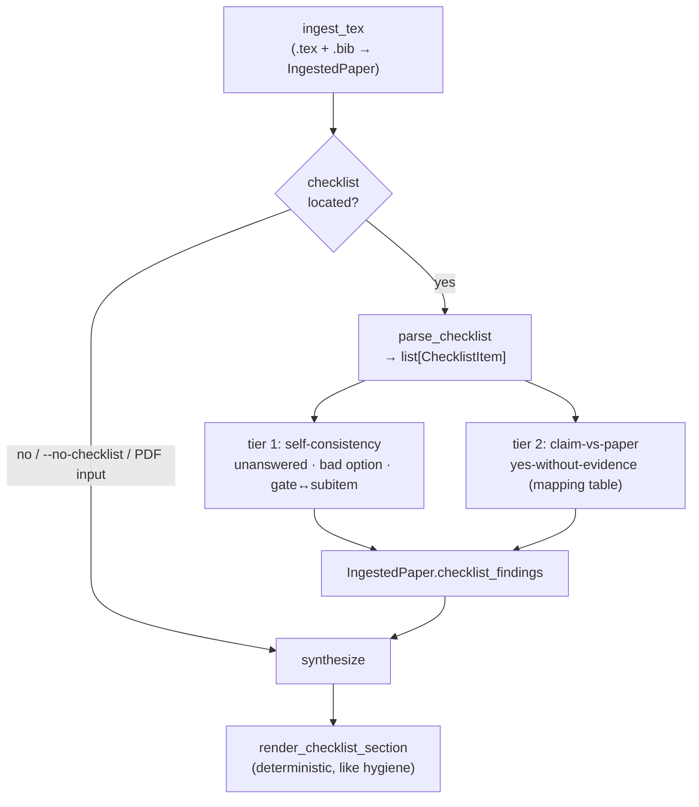

# feat: AAAI reproducibility-checklist linter

## Summary

Add a deterministic **checklist-linter** stage to `prereview` that reads a venue
reproducibility checklist (AAAI-27 first), parses its `\question`/response
structure, and emits findings in two tiers:

1. **Self-consistency** — unanswered items, responses outside the allowed option
   set, and gate-vs-subitem inconsistencies. Needs only the checklist file.
2. **Claim-vs-paper cross-checks** — a checklist answer of "yes" whose supporting
   evidence is absent from the paper (e.g. "code will be made publicly available"
   = yes, but no repository URL appears anywhere). Reuses the already-parsed
   paper body.

Findings render in a new deterministic review section, mirroring the existing
`render_hygiene_section`. The work follows the shipped-check pattern exactly:
new pydantic models → detector functions → attach to `IngestedPaper` → render
deterministically → CLI flag.

This is the highest-leverage Stage-1 addition from the June-2026 roadmap
re-validation: it attaches to a **mandatory, desk-reject-enforced** artifact, the
high-precision version is deterministic (sidestepping the LLM-judgment ceiling),
and nothing on the current roadmap covers it.

---

## Problem Frame

AAAI (and NeurIPS/ACL/ARR) require a reproducibility/responsible-research
checklist. ACL/ARR has desk-rejected "incorrect, incomplete or misleading"
checklists since December 2024. Authors routinely answer "yes" to items the
paper does not actually support, or leave the checklist half-filled — both are
mechanically detectable and both carry real submission risk.

`prereview` already parses the `.tex`/`.bib` and runs deterministic hygiene
checks (broken refs, unused bibkeys, link health, retractions). The checklist is
the same *class* of artifact — structured, source-level, mechanically
checkable — but is currently invisible to the tool. This plan closes that gap for
the venue the author is actually submitting to (AAAI-27).

**Grounding artifact:** the AAAI-27 author kit ships
`ReproducibilityChecklist.tex` with a clean, parseable structure:

```latex
\checksubsection{Computational Experiments}
\begin{itemize}
\question{Does this paper include computational experiments?}{(yes/no)}
Type your response here

\ifyespoints{If yes, please address the following points:}
\begin{itemize}
    \question{This paper specifies the computing infrastructure used ... GPU/CPU models ...}{(yes/partial/no)}
    Type your response here
    ...
```

Key structural facts the parser keys on:
- `\checksubsection{NAME}` delimits a section.
- `\question{TEXT}{(opts)}` is followed by a response line; an unanswered item
  still reads `Type your response here`.
- Allowed options live verbatim in the second braced arg, e.g. `(yes/partial/no/NA)`.
- Conditional sub-blocks are introduced by a gate question ("Does this paper
  …?" `(yes/no)`) plus `\ifyespoints{...}` and a nested `itemize`. Sub-items
  belong to that gate.

---

## Scope

**In scope**
- Locate the checklist (explicit `--checklist PATH`, `\input` in the main `.tex`,
  or sibling `ReproducibilityChecklist.tex`).
- Parse the AAAI `\question` structure into typed items with section + gate
  context.
- Tier-1 self-consistency findings.
- Tier-2 claim-vs-paper cross-checks for a **small, high-precision** set of
  answer→evidence mappings, externalized as data.
- Render a new "Reproducibility checklist" review section + a methodology line.
- A `--no-checklist` opt-out.

**Out of scope (Deferred to Follow-Up Work)**
- Other venues' checklists (NeurIPS 15-question, ACL/ARR Responsible-NLP). The
  parser is generic and the mappings are data, so these are additive later.
- Any item requiring subjective judgment ("is the limitations section
  *adequate*"). Deferred per the precision-over-recall constraint.
- Verifying that a *present* repo URL actually resolves — link-health already
  probes URLs; the cross-check here is presence, not reachability.
- PDF-only first-class support. Checklist linting is TeX-source-first; on a PDF
  input the stage is skipped with a one-line note.

---

## Key Technical Decisions

**KTD-1: New `checklist.py` module, mirroring `tex_ingest.py`/`link_health.py`.**
Detector functions operate on raw text and return pydantic models; no LLM call.
Keeps the checklist logic isolated and unit-testable in pure form, exactly like
`find_broken_refs` / `extract_urls`.

**KTD-2: Generic `\question` parser, AAAI-specific *data*.** The parser does not
hard-code question strings — it extracts `(question_text, options, response,
section, gate)` tuples. The cross-check answer→evidence mappings live in an
externalized table keyed on robust question-text substrings. Adding a venue or
an AAAI year is then data, not code (supports the roadmap's later venue
expansion).

**KTD-3: Cross-checks are presence-based and advisory-framed.** Each cross-check
asks "does the paper contain *any* evidence of the thing this 'yes' claims?"
using keyword/pattern detectors over the already-stripped body + raw URLs. Every
finding quotes the exact checklist item and names the evidence it looked for, and
is phrased "verify" not "you lied." This is the precision-over-recall discipline
the whole tool is built on; a cross-check that cannot be made high-precision is
left out rather than shipped noisy. (See origin: compass report, Part 1 item 2
and Part 4 item (a).)

**KTD-4: Findings hang off `IngestedPaper`, rendered in `synthesize.py`.**
Consistent with `broken_refs` / `link_checks` / `unused_bibkeys`. The new section
renders only when the checklist was found and produced findings, and degrades to
a single informational line ("checklist found, no issues") when clean — matching
`render_hygiene_section`'s return-`None`-when-empty contract.

**KTD-5: Checklist discovery order.** `--checklist PATH` > `\input{...}` whose
target basename contains "checklist" (resolved relative to the main `.tex`) >
sibling `ReproducibilityChecklist.tex`. If none found and no flag given, skip
silently (the author may not have started the checklist yet); if `--checklist`
points at a missing file, error clearly.

---

## High-Level Technical Design

New stage slots between ingest and synthesize, reusing the parsed paper body:



Parsed item shape (directional):

```text
ChecklistItem
  section:   "Computational Experiments"
  question:  "This paper specifies the computing infrastructure ... GPU/CPU models ..."
  options:   ["yes", "partial", "no"]          # parsed from "(yes/partial/no)"
  response:  "yes" | "" | "Type your response here"
  is_gate:   false                              # true for "Does this paper ...?" items
  gate_question: "Does this paper include computational experiments?"  # parent gate, or None
```

`ChecklistFinding` carries: `kind` (`unanswered` | `invalid_response` |
`gate_inconsistency` | `claim_unsupported`), the offending item's question text,
the response, and a human-readable `detail` naming the evidence sought (tier 2).

---

## Implementation Units

### U1. Checklist data models + `IngestedPaper` wiring

**Goal:** Define the typed shapes and surface them on the paper bundle.
**Requirements:** Foundation for all later units.
**Dependencies:** none.
**Files:**
- `src/prereview/models.py` (modify)
- `tests/test_models.py` (create, if not present) or extend an existing model test

**Approach:** Add `ChecklistItem` and `ChecklistFinding` pydantic models next to
`BrokenRef`/`LinkCheck`. Add `checklist_findings: list[ChecklistFinding] =
Field(default_factory=list)` to `IngestedPaper`. Add an optional
`checklist_found: bool = False` so the renderer can distinguish "no checklist"
from "checklist clean". Mirror the existing docstring style (explain *why* the
field exists, as `BrokenRef`/`LinkCheck` do).

**Patterns to follow:** `BrokenRef`, `LinkCheck` in `models.py`.

**Test scenarios:**
- A `ChecklistFinding` round-trips through pydantic with each `kind` value.
- `IngestedPaper()` defaults `checklist_findings` to `[]` and `checklist_found`
  to `False` (back-compat with PDF path that never sets them).
- `Test expectation: light` — these are mostly schema definitions; one
  construction/default test per new model.

---

### U2. Checklist discovery + parser (`checklist.py`)

**Goal:** Locate the checklist file and parse it into `list[ChecklistItem]`.
**Requirements:** Tier-1 and tier-2 both consume this.
**Dependencies:** U1.
**Files:**
- `src/prereview/checklist.py` (create)
- `tests/test_checklist.py` (create)
- `tests/fixtures/ReproducibilityChecklist.tex` (create — copy the real AAAI-27
  kit file so the parser is tested against the genuine artifact)

**Approach:** Implement `find_checklist_file(tex_path, tex_text, explicit:
Optional[Path]) -> Optional[Path]` per KTD-5, reusing the comment-stripping and
`\input`-scanning style already in `tex_ingest`. Implement
`parse_checklist(text) -> list[ChecklistItem]`:
- Split on `\checksubsection{...}` to track the current section.
- Match `\question{TEXT}{OPTS}` (brace-aware, like `extract_title`'s nested
  handling); the response is the text between this `\question` and the next
  `\question`/`\checksubsection`/`\end{itemize}`, trimmed of LaTeX whitespace
  commands.
- Parse `OPTS` ("(yes/partial/no/NA)") into a lowercased option list.
- Mark an item `is_gate` when its options are exactly `[yes, no]` and the text
  matches `^Does this paper`; associate following nested items with that gate
  until the gate's block closes.

Reuse `tex_ingest._clean_bib_value`-style stripping where useful, but keep
`checklist.py` self-contained (import small helpers rather than entangling the
two modules).

**Patterns to follow:** `find_bib_file`, `find_broken_refs`, `extract_title`
(brace-aware regex) in `tex_ingest.py`.

**Test scenarios:**
- Parses the real fixture: asserts the expected section names appear and the
  total `\question` count matches the kit (guards against silent regex drift).
- An answered item ("yes" on its own line) yields `response == "yes"`; an
  untouched item yields the literal `Type your response here`.
- Options string `(yes/partial/no/NA)` parses to `["yes","partial","no","na"]`.
- A gate question ("Does this paper include computational experiments?") is
  flagged `is_gate`; its sub-items carry that `gate_question`.
- `find_checklist_file`: explicit path wins; `\input{ReproducibilityChecklist}`
  resolves relative to the main `.tex`; sibling file is found; returns `None`
  when nothing matches.
- Edge: a checklist with a `\question` containing a nested brace in the text does
  not truncate the question.
- Edge: empty/garbage file → `parse_checklist` returns `[]`, no exception.

---

### U3. Tier-1 self-consistency checks

**Goal:** Detect unanswered items, invalid responses, and gate↔subitem mismatches.
**Requirements:** Tier-1 of the linter.
**Dependencies:** U2.
**Files:**
- `src/prereview/checklist.py` (modify)
- `tests/test_checklist.py` (modify)

**Approach:** `check_self_consistency(items) -> list[ChecklistFinding]`:
- **unanswered** — response is empty or contains `Type your response here`
  (case/space-insensitive). Skip gate items whose own answer legitimately
  cascades (still flag a blank gate).
- **invalid_response** — non-empty response not in the item's option list (after
  lowercasing/trimming). Tolerate trailing punctuation and surrounding markup.
- **gate_inconsistency** — gate answered "no" but ≥1 of its sub-items is answered
  with a substantive (non-NA, non-blank) response; or gate answered "yes" but all
  its sub-items are blank.

Each finding names the section + question and, for invalid responses, shows the
offending value and the allowed set.

**Patterns to follow:** `find_unused_bibkeys` (pure list→list), finding objects
like `BrokenRef`.

**Test scenarios:**
- All-blank checklist → one `unanswered` finding per applicable question (count
  asserted).
- Response `"Yes."` is accepted (case/punctuation tolerant); `"maybe"` →
  `invalid_response` quoting allowed options.
- Gate "no" + an answered sub-item → one `gate_inconsistency`.
- Gate "yes" + all sub-items blank → one `gate_inconsistency` (plus the
  unanswered sub-items, deduped sensibly so the user isn't double-warned —
  assert the gate-inconsistency is present and not duplicated per sub-item).
- Fully and correctly filled checklist → `[]`.
- `Test expectation: full` — happy path, each error kind, and the gate edge
  cases above.

---

### U4. Tier-2 claim-vs-paper cross-checks

**Goal:** Flag "yes" answers whose supporting evidence is absent from the paper.
**Requirements:** Tier-2 of the linter — the high-value tier.
**Dependencies:** U2 (parsed items), and the paper body from `IngestedPaper`.
**Files:**
- `src/prereview/checklist.py` (modify — add the mapping table + detector)
- `tests/test_checklist.py` (modify)

**Approach:** Define an externalized `CROSS_CHECKS` table: each entry is
`(question_substring, evidence_label, detector)` where `detector(body_text,
link_checks) -> bool` returns True when supporting evidence is present. Start with
a deliberately small, high-precision set:
- **Code availability** ("code … publicly available" / "source code … included")
  → a repository URL is present (github/gitlab/zenodo/osf/huggingface, in body
  `\url`/`\href` or any `LinkCheck`).
- **Computing infrastructure** ("computing infrastructure … GPU/CPU models") →
  hardware keywords present (GPU, CPU, A100, H100, RTX, TPU, "GB memory",
  GPU-hours, etc.).
- **Number of runs** ("number of algorithm runs" / "number of … runs used") →
  run/seed/trial keywords present.
- **Dataset availability** ("datasets … publicly available") → a dataset URL or a
  dataset citation/keyword present.

`check_claims_vs_paper(items, body_text, link_checks) -> list[ChecklistFinding]`:
for each parsed item whose response is "yes"/"partial" and whose question matches
a `CROSS_CHECKS` substring, run the detector; emit a `claim_unsupported` finding
(naming the evidence sought) when no evidence is found. Each finding is advisory
("answered 'yes' but no … found in the paper — verify").

Detectors operate on the already-stripped body (`paper.sections`) plus
`paper.link_checks` (URLs already extracted in `tex_ingest`); no new extraction.

**Patterns to follow:** keyword scanning is new but small; URL provenance reuses
the `LinkCheck` list from `extract_urls`. Keep detectors pure and individually
testable.

**Test scenarios:**
- "yes" to code availability + a GitHub `LinkCheck` present → no finding.
- "yes" to code availability + no repo URL anywhere → one `claim_unsupported`
  naming "repository URL".
- "yes" to computing infrastructure + body mentions "A100" → no finding; + body
  silent on hardware → finding.
- "no"/blank answers are never cross-checked (only yes/partial trigger).
- A question with no mapping entry is ignored (assert no spurious findings).
- Precision guard: a body that says "we will release code at <github url>"
  satisfies the code check via the URL, not via the word "code" alone (assert the
  detector keys on the URL/keyword it claims to, so the test pins behavior).
- `Test expectation: full` — one positive + one negative per shipped mapping, plus
  the trigger-gating cases.

---

### U5. Wire into `ingest_tex`, pipeline, and CLI

**Goal:** Run the linter during tex ingest and expose `--checklist` / `--no-checklist`.
**Requirements:** Makes the feature reachable end-to-end.
**Dependencies:** U2, U3, U4.
**Files:**
- `src/prereview/tex_ingest.py` (modify — call discovery + parse + both checkers)
- `src/prereview/pipeline.py` (modify — thread `checklist_path` / `run_checklist`,
  add a stage log line)
- `src/prereview/cli.py` (modify — `--checklist PATH`, `--no-checklist`)
- `tests/test_tex_ingest.py` (modify)
- `tests/test_pipeline.py` (modify)

**Approach:** In `ingest_tex`, after the existing hygiene calls, run discovery →
`parse_checklist` → `check_self_consistency` + `check_claims_vs_paper`, populating
`paper.checklist_findings` and `paper.checklist_found`. Use the stripped `body`
already computed for cross-check detectors. Thread an optional
`checklist_path: Optional[Path]` and `run_checklist: bool = True` through
`ingest_tex` and `run_pipeline` (PDF path leaves the fields at their defaults —
the checklist linter is TeX-only). Add `--checklist` / `--no-checklist` to the
parser and pass through `main`. Add a verbose stage log
(`f"found {n} checklist issue(s)"`) consistent with the existing `_log` lines.

**Execution note:** start with a failing pipeline test that feeds a `.tex` whose
sibling checklist has a known yes-without-evidence, and assert the finding reaches
`IngestedPaper` — this pins the wiring contract before filling in details.

**Patterns to follow:** how `broken_refs`/`unused_bibkeys`/`link_checks` are
populated in `ingest_tex`; `--bib` flag plumbing in `cli.py`; the `bib_path`
thread-through in `run_pipeline`.

**Test scenarios:**
- `.tex` with a sibling `ReproducibilityChecklist.tex` → `paper.checklist_found`
  is True and findings are populated.
- `.tex` with no checklist anywhere → `checklist_found` False, `checklist_findings`
  empty, no error.
- `--no-checklist` → linter skipped even when a checklist exists.
- `--checklist /missing/path` → clean CLI error (mirrors the `input not found`
  pattern).
- PDF input path → checklist fields stay at defaults (no crash, no attempt).
- `Test expectation: full` — discovery on/off, opt-out, and the missing-path error.

---

### U6. Render the checklist review section

**Goal:** Surface findings in the Markdown review + the methodology summary.
**Requirements:** Author-facing output.
**Dependencies:** U1–U5.
**Files:**
- `src/prereview/synthesize.py` (modify — add `render_checklist_section`, stitch
  it in, extend `render_methodology`)
- `tests/test_synthesize.py` (modify)

**Approach:** Add `render_checklist_section(bundle) -> Optional[str]` mirroring
`render_hygiene_section`: return `None` when no checklist was found; render a
short "checklist located, no issues" confirmation when found-but-clean; otherwise
group findings by `kind` under clear subheadings (Unanswered items / Invalid
responses / Gate inconsistencies / Answers not supported by the paper), each
finding quoting the checklist question and (tier-2) the evidence sought. Stitch it
into `stitch_review` right after the hygiene section. Add one line to
`render_methodology` summarizing checklist counts (e.g. "Reproducibility checklist:
N items, M issues flagged"), and add "Reproducibility-checklist claims (beyond the
deterministic presence checks)" is **not** independently verified — keep the
existing "what this tool does not check" honesty.

**Patterns to follow:** `render_hygiene_section` (subheading-per-category,
return-`None`-when-empty, count-aware phrasing); `render_methodology`'s
`hygiene_line`.

**Test scenarios:**
- Bundle with one finding of each kind → section contains all four subheadings and
  quotes each question.
- `checklist_found=True`, zero findings → renders the clean-confirmation line, not
  `None`.
- `checklist_found=False` → `render_checklist_section` returns `None` and
  `stitch_review` omits the section entirely.
- `render_methodology` includes the checklist line only when a checklist was found
  (assert wording for found/clean vs found/flagged).
- The tier-2 findings render with "verify"-style advisory framing, never an
  accusation (assert phrasing).
- `Test expectation: full` — render of each kind, the two empty states, and the
  methodology line.

---

## Test Strategy

- Pure functions (`parse_checklist`, the two checkers, detectors, renderer) are
  unit-tested directly — no network, no LLM — matching the existing
  `test_tex_ingest.py` / `test_synthesize.py` style.
- A copy of the real AAAI-27 `ReproducibilityChecklist.tex` is the parser's
  golden fixture so regex drift is caught against the genuine artifact.
- Pipeline/CLI wiring tested with small synthetic `.tex` + checklist fixtures.
- No new external dependency (`huggingface_hub` etc. is a *later* Stage-1 plan,
  not this one).

---

## Risks & Mitigations

- **Cross-check false positives** (the core trust risk). Mitigation: ship only a
  handful of high-precision mappings; presence-based detectors; advisory framing;
  every finding quotes the item and the evidence sought; `--no-checklist` escape
  hatch. Lower-confidence ideas stay deferred.
- **Parser brittleness across AAAI years / `\question` macro tweaks.** Mitigation:
  generic structural parser (not hard-coded strings) + golden-fixture test; a
  parse that finds zero questions degrades to "checklist found but unparseable —
  skipped", never a crash.
- **Checklist `\input` into the main file vs standalone.** Discovery handles all
  three placements (KTD-5); when `\input`-ed, the checklist text is part of the
  main `.tex` the author passes, so parsing the main file's text is sufficient.

---

## Deferred to Follow-Up Work

- NeurIPS / ACL-ARR checklist support (additive: new fixture + mappings).
- Reachability-aware cross-checks (does the claimed repo URL actually resolve)
  by composing with `link_health`.
- The broader **venue-rules table** (page limits, mandatory sections, ethics
  statement) — a sibling Stage-1 item, planned separately.
- Anonymization leak detector and arXiv-version staleness — separate Stage-1/2
  plans per the roadmap re-validation.

---

## Sources & Research

- `~/Downloads/compass_artifact_wf-83c3d53c-...md` — June-2026 roadmap
  re-validation. Ranks the checklist linter the **top** Stage-1 add; cites
  ACL/ARR desk-reject enforcement (Dec 2024) and the NeurIPS-2024 Checklist
  Assistant field experiment (arXiv:2411.03417, ~70% of authors would revise) as
  evidence the feedback changes author behavior; flags deterministic
  presence/consistency checks as the high-precision subset to ship.
- AAAI-27 author kit `ReproducibilityChecklist.tex` — the concrete artifact the
  parser targets (sections, `\question`/`\ifyespoints` structure, option strings).
- `~/Downloads/aaai27_redteam_review.md` — Part E corroborates the broader
  venue-check family (leftover `[CITE-TODO]` markers, over-length abstract,
  deanonymization vectors) for later Stage-1 items.
- Codebase patterns: `src/prereview/tex_ingest.py` (detector functions),
  `src/prereview/synthesize.py` `render_hygiene_section` (deterministic section),
  `src/prereview/models.py` (`BrokenRef`/`LinkCheck`), `tests/test_link_health.py`
  / `tests/test_tex_ingest.py` (test style).
