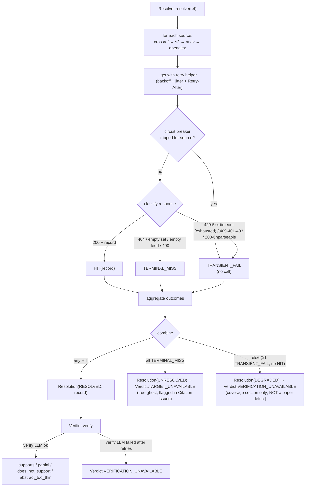

# feat: recover-then-disclose hardening (retry transient failures, disclose coverage gaps)

## Summary

Harden `prereview` so a transient infrastructure failure can never silently corrupt
the review it produces on a real AAAI-27 submission. Two moves, in priority order:

1. **Recover.** Add capped, jittered retry-with-backoff to the resolver HTTP calls
   and to `prereview`'s own LLM calls, plus a per-source run-level circuit breaker, so
   a momentary `429`/`5xx`/timeout stops being laundered into a false "ghost citation"
   or a fake "abstain."
2. **Disclose.** Make every non-recoverable gap visible: a new three-state resolution
   outcome that reserves "ghost" for genuinely-not-found references, a new
   `VERIFICATION_UNAVAILABLE` verdict distinct from an honest `ABSTRACT_TOO_THIN`, a
   dedicated **Review coverage & reliability** section in the Markdown, a clean CLI
   error path (no tracebacks), and a distinct exit code when a run completes with
   infrastructure-caused coverage gaps.

The work threads through the pipeline (`models` → `resolve` → `verify` → `synthesize`
→ `pipeline` → `cli`) plus one new retry helper module and the LLM chokepoint
(`llm.acompletion_text`). It deliberately does **not** harden arbitrary-PDF parsing,
re-open the suggested-rating-bias question, or add new review checks.

One change is forced by current reality rather than the approach itself: **OpenAlex
began requiring a free API key on 2026-02-13** (polite pool and `mailto` removed;
keyless traffic gets ~100 credits/day then `409`). The current `_openalex` code still
sends `mailto=` and treats the resulting `409` as "not found," so OpenAlex already
degrades into false ghosts — fixing it is part of this plan.

---

## Problem Frame

The user wants the **best possible feedback** when running `prereview` on their own
AAAI-27 TeX submission, and has not yet run it on a real draft. In the brainstorm we
established the priority order: a crash is the *least* harmful outcome (you notice it
and re-run); a review that *looks* complete but silently isn't is the *worst*. The
enemy is silent degradation that corrupts trust in the review.

The codebase has the exact defect this targets. Every resolver source method treats
*any* non-200 (including `429`/`5xx`) and *any* exception identically to "not found":
it returns `None` or `continue`s the fall-through loop (`src/prereview/resolve.py`
lines 193-197, 226-227, 242-243, 263-265, 285-290, 317-318, 340-341, 355-356,
364-365). When all four sources fall through, `verify.py` emits
`Verdict.TARGET_UNAVAILABLE` with rationale "Reference did not resolve …"
(`src/prereview/verify.py:256-265`). A one-second `429` from Semantic Scholar is thus
laundered into a false ghost citation in the user's review — and the synthesis prompt
is *fed* that inflated unresolved count (`src/prereview/synthesize.py:573,598`) and
told to call out ghost references, so the false positive poisons the LLM-written
Weaknesses too.

The same shape appears at the LLM layer: a failed verification call is caught and
recorded as `Verdict.ABSTRACT_TOO_THIN` (`src/prereview/verify.py:329-339`) —
structurally identical to an honest "abstract too thin to tell," differing only in
rationale text. And a failed synthesis prose call is *not* caught at all
(`src/prereview/synthesize.py:691-694`), so it aborts the whole pipeline and discards
the deterministic sections (citation issues, hygiene, checklist, methodology) that
needed no LLM. At the CLI, only `KeyboardInterrupt` and `NotImplementedError` are
handled (`src/prereview/cli.py:140-145`); everything else surfaces as a raw traceback.

There is no signal anywhere that tells the user whether the review actually covered
everything. That signal — plus recovering the failures that are recoverable — is what
converts a fragile pipeline into feedback the user can trust.

**Note on the user's path.** The input is the user's own well-formed AAAI-27 `.tex`.
For TeX input the bibliography parse is deterministic (`tex_ingest.py` imports no LLM),
so the only LLM calls on their path are **verify** and **synthesize**; PDF-mode
bibliography parsing via `ingest.parse_references` is the third LLM site and benefits
from the same chokepoint fix. This is why the retry leverage concentrates on the
resolver and the verify/synthesize LLM calls.

---

## Scope

**In scope**
- Retry-with-backoff (full jitter, capped, attempt-limited) on the four resolver APIs
  and `prereview`'s own direct LLM calls.
- A per-source run-level circuit breaker so retries cannot amplify a systemic outage.
- A three-state resolution outcome (`HIT` / `TERMINAL_MISS` / `TRANSIENT_FAIL`) and a
  new `VERIFICATION_UNAVAILABLE` verdict, both threaded to the renderer.
- Per-citation and per-stage error boundaries; graceful synthesis degradation that
  preserves the deterministic review sections.
- A dedicated **Review coverage & reliability** section, a clean CLI error path, a
  distinct exit code for infrastructure-caused coverage gaps, and a loud
  zero-citation / empty-extraction warning.
- OpenAlex API-key support + `mailto` removal + `409`-as-terminal-infra; Crossref
  list-endpoint gate compliance; `OPENALEX_API_KEY` env plumbing.

**Out of scope (Deferred to Follow-Up Work)**
- Arbitrary-PDF / malformed-input hardening (scanned-image detection, corrupt-`.bib`
  recovery). The user feeds well-formed AAAI-27 TeX; this is Approach C territory.
- The suggested-rating-bias open decision (Keuper 2025) — a separate design question.
- Any new review checks (OpenReview enrichment, HF/PWC existence, anonymization,
  numerical sanity) — roadmap features, not robustness.
- Retrying the Verifier's OA-PDF *fetch* (`verify.py:_fetch_full_text`). It already
  degrades safely to abstract-only with `abstract_only=True` disclosed, so it is a
  honest downgrade, not silent corruption. Listed deferred, not done.
- Conditional-request caching (`ETag`/`If-Modified-Since`) — a quota optimization, not
  a correctness fix.

---

## Requirements

- **R1** A transient resolver failure (`429`/`5xx`/timeout/connection error) must never
  cause a real, resolvable citation to be reported as a ghost/unresolved reference.
- **R2** Resolution must distinguish three outcomes: resolved, terminally-unresolved
  (true ghost — every source gave an authoritative "not here"), and
  infrastructure-degraded (at least one source failed transiently after retries and no
  source resolved).
- **R3** A verification that could not be completed due to infrastructure (resolution
  degraded, or the verify LLM call failed after retries) must be recorded as a distinct
  "couldn't verify" outcome, never as an honest `ABSTRACT_TOO_THIN` or as a ghost.
- **R4** Transient resolver and LLM failures are retried with capped exponential backoff
  **with full jitter**, honoring `Retry-After` when the server sends it; retries are
  bounded per-call and per-source-per-run so they cannot mask or amplify a systemic
  outage.
- **R5** One failing citation must not abort the run, and a failed synthesis prose pass
  must still produce the deterministic review sections.
- **R6** The review carries a prominent coverage/reliability section distinguishing
  recovered, honestly-uncertain, and non-recoverable outcomes, so a review that looks
  complete is verifiably complete.
- **R7** The CLI surfaces failures as clean, actionable messages (no Python tracebacks)
  and signals a run that completed with non-recoverable coverage gaps via a distinct
  exit code.
- **R8** A run that parses zero references or zero in-text citations emits a loud
  warning rather than reporting success.
- **R9** OpenAlex must function under its post-2026-02-13 access model (API key; no
  `mailto`; `409` classified as terminal-infrastructure, not "not found") so it does
  not silently drop out and inflate the false-ghost count.

**Success criteria.** With APIs healthy and `OPENALEX_API_KEY` / `S2_API_KEY` set, a
clean run reports full coverage and exits 0. Under a transient `429` storm against a
paper whose citations are all real, the review shows **zero** false ghosts, the
coverage section reports "could not verify N (infrastructure)," and the process exits
with the distinct coverage-gap code. No run produces a raw traceback.

---

## Key Technical Decisions

**KTD-1: Three-state resolution outcome, ghost reserved for all-terminal.**
Replace `Resolver.resolve`'s `Optional[CanonicalRecord]` return with a `Resolution`
(`status: ResolutionStatus`, `record: Optional[CanonicalRecord]`). Each per-source
method returns an internal three-state outcome; the fall-through aggregator combines
them: any `HIT` → resolved; **all** sources `TERMINAL_MISS` → unresolved (true ghost);
otherwise (≥1 `TRANSIENT_FAIL`, no `HIT`) → degraded. This single distinction is the
core fix for R1/R2 and is the design the best-practices research converged on
independently. Bias is explicit: prefer a false "couldn't-verify" over a false "ghost"
— mirroring the existing philosophy at `resolve.py:326-333` ("a missed retraction is
preferable to a false positive that would scare a user").

**KTD-2: Hand-rolled `tenacity` retry helper for httpx; `litellm num_retries` for LLM.**
httpx has no status-code retry (`AsyncHTTPTransport(retries=)` is connection-level
only), so HTTP retry is a small `tenacity`-based helper. `tenacity` is currently present
only transitively (via the declared-but-unused `paper-qa`); U2 promotes it to a direct
dependency. The LLM path is the opposite: `litellm.acompletion` accepts `num_retries=N`
(default 0 today) and performs library-managed retry-with-backoff, reraising the original
API exception on exhaustion so callers can handle it. (The exact internal mechanism —
provider-SDK `max_retries` vs litellm's own retry wrapper — varies by litellm version;
the plan depends only on that observable contract, which U5's behavioral test pins.) We
use the library's built-in for the LLM (don't reinvent) and hand-roll only where the
library forces us to. **Single retry layer only** — do not add httpx-transport retries on
top. `paper-qa` is a declared dependency but is **not** currently imported in
`src/prereview/` (PDF text uses `pypdf`; the bib parse uses `acompletion_json`), so there
is no paper-qa LLM path to double-wrap — the single-layer rule is precautionary for any
future adoption. See Alternatives Considered for the rejected unified-helper and
`litellm.Router` options.

**KTD-3: Full-jitter capped backoff, bounded for an interactive CLI.**
Per-call: base ≈ 0.75 s, cap ≈ 8 s, **max 3 attempts (≤2 retries)** per source, **full
jitter** (`sleep = random(0, min(cap, base·2^attempt))` — AWS's tested recommendation;
equal jitter measured worse, decorrelated is comparable but unnecessary here). When a
`Retry-After` header is present (OpenAlex is the only source here that sends one), wait
`max(retry_after, computed)` and skip that step's randomization — never retry sooner
than the server says. Parse `Retry-After` defensively as either delta-seconds or
HTTP-date, and clamp to ≤ 60 s so a garbage value can't hang the CLI.

**KTD-4: Per-source run-level circuit breaker (the outage-amplification guard).**
Beyond the per-call cap, keep a per-source consecutive-transient-failure counter for the
whole run; after a threshold (default 5) trip the breaker and stop retrying — even stop
*calling* — that source for the remainder of the run, emitting `TRANSIENT_FAIL`
immediately for affected refs. The counter is *consecutive* and resets on any
`HIT`/`TERMINAL_MISS` for that source; because a half-working source that alternates
fail/success never trips a consecutive counter, also keep a per-source **total retry
budget** for the run and stop retrying that source once it is spent. This is the concrete
answer to the user's "retries masking a systemic outage" concern (AWS Builders' Library:
"retries are selfish"; cap total retries; stop when retries aren't improving
availability).

**KTD-5: Retriable-vs-terminal classification, shared shape across HTTP and LLM.**
Retry (transient): `429` (non-credit), `500/502/503/504`, connection errors, read/connect
timeouts; for the LLM, `RateLimitError`/`Timeout`/`APIConnectionError`/
`ServiceUnavailableError`/`InternalServerError`. Terminal (do not retry): `400`, `401`,
`403`, `404`, an empty result set / empty arXiv feed (arXiv returns `200` + zero
`<entry>` for "no match", **not** `404`), and for the LLM every `BadRequestError`
subclass including `ContentPolicyViolationError` (a refusal) and
`ContextWindowExceededError`. OpenAlex `409` (keyless/credit-exhausted) is terminal
**infrastructure**, classified `TRANSIENT_FAIL` for outcome purposes (it must never read
as "not found"), and is not retried. A `2xx` whose body fails to parse (`r.json()`
raising, an arXiv `ET.ParseError`, or a structurally-null payload like Crossref
`{"message": null}`) is a transient symptom, classified `TRANSIENT_FAIL` — **not**
`TERMINAL_MISS`; only a successfully-parsed authoritative empty result set is
`TERMINAL_MISS`.

**KTD-6: New `VERIFICATION_UNAVAILABLE` verdict, excluded from paper-problem flagging.**
Add one verdict value meaning "could not complete verification due to infrastructure"
(resolution degraded, or the verify LLM call failed after retries); the rationale string
names which stage failed. It must be **excluded** from `_PROBLEM_VERDICTS` /
`_is_problematic` (`synthesize.py:39-60`) so it never appears in **Citation Issues** as a
paper defect — it belongs only in the coverage section. One verdict (not two) keeps the
enum and the report counts simple; stage detail lives in the rationale.

**KTD-7: `CoverageReport` model populated by the pipeline, rendered deterministically.**
Aggregate the run's integrity counts into a `CoverageReport` attached to `ReviewBundle`
(resolved, true-ghost, resolution-degraded, verification-degraded, recovered-after-retry,
circuit-broken sources, synthesis-degraded flag, references/citations parsed). The
pipeline populates it; a new `render_coverage_section(bundle)` renders it, mirroring
`render_hygiene_section`'s deterministic, return-`None`-when-empty contract. This keeps
the trust signal deterministic and model-independent, like the other trustworthy
sections.

**KTD-8: Coverage section is dedicated and prominent; exit code distinguishes gaps.**
(Resolves brainstorm call-outs 1 and 2, defaulted on "proceed".) The coverage report is
its own section placed early (immediately after the head, before `## Summary`), **not** folded into
"Methodology and limits" where it would be buried. Exit codes: `0` = ran and every
citation reached a terminal *judgment* (incl. honest abstention / does-not-support);
a distinct **`3`** = completed but ≥1 citation was infrastructure-degraded (coverage
gap); `1` = hard failure (clean message, no traceback); existing `130` (interrupt) and
`2` (`NotImplementedError`) unchanged. Honest verdicts never trigger `3`.

**KTD-9: OpenAlex post-2026-02 access model.** Add `OPENALEX_API_KEY` (sent per the
OpenAlex auth guide), stop sending `mailto`/email to OpenAlex specifically, and classify
`409` as terminal-infrastructure. Keep `mailto` for Crossref (still polite-pool there).
This restores OpenAlex as a reliable fourth source and as the retraction-check source
(`_openalex_is_retracted`), which otherwise silently dies after ~100 keyless
credits/day. `S2_API_KEY` is already supported; document it as near-mandatory.

---

## High-Level Technical Design

Resolution outcome → verdict mapping is the heart of the change. Today every
non-`HIT` collapses to a single `None`/ghost; the new flow separates the two
non-resolving outcomes and routes the degraded one to an honest verdict.



Retry helper contract (directional, not implementation spec):

```text
http_retry.get_with_retry(client, method/url/params/headers, *, policy) -> httpx.Response
  retry while attempts < policy.max_attempts AND status/exc is transient:
    wait = Retry-After (parsed seconds-or-date, clamped) if present
         else random(0, min(policy.cap, policy.base * 2**attempt))   # full jitter
  return the response on terminal status (caller classifies HIT vs TERMINAL_MISS)
  raise TransientExhausted after the cap (caller maps to TRANSIENT_FAIL)
classify_status(status) -> {RETRY | TERMINAL}   # 429/5xx/timeout=RETRY; 400/401/403/404=TERMINAL
```

`CoverageReport` shape (directional):

```text
CoverageReport
  references_parsed:int  citations_checked:int
  resolved:int  ghost_unresolved:int            # true ghosts (all-terminal)
  resolution_degraded:int  verification_degraded:int   # infrastructure "couldn't verify"
  recovered_after_retry:int                      # calls that succeeded on a retry
  circuit_broken_sources:list[str]               # sources stopped mid-run
  synthesis_degraded:bool                        # prose pass failed; deterministic core kept
  has_coverage_gap -> bool                       # drives exit code 3
```

---

## Implementation Units

### U1. Outcome, verdict, and coverage data models

**Goal:** Define the typed shapes the rest of the plan threads through.
**Requirements:** R2, R3, R6 (foundation).
**Dependencies:** none.
**Files:**
- `src/prereview/models.py` (modify)
- `tests/test_models.py` (modify)

**Approach:** Add `ResolutionStatus` enum (`RESOLVED`, `UNRESOLVED`, `DEGRADED`) and a
`Resolution` model (`status`, `record: Optional[CanonicalRecord]`). Add
`Verdict.VERIFICATION_UNAVAILABLE`. Add a `CoverageReport` model with the fields in the
HTD sketch and a `has_coverage_gap` computed helper
(`resolution_degraded + verification_degraded > 0`). Add `coverage: Optional[CoverageReport]
= None` to `ReviewBundle` (keep the existing count fields for back-compat with
`render_methodology`). Mirror the existing docstring style (explain *why* each field
exists, as `BrokenRef`/`LinkCheck` do).

**Patterns to follow:** `Verdict` enum, `CanonicalRecord`, `BrokenRef` in `models.py`.

**Test scenarios:**
- `Resolution` round-trips each `ResolutionStatus`; `record` is `None` for
  `UNRESOLVED`/`DEGRADED`.
- `Verdict.VERIFICATION_UNAVAILABLE` exists and is distinct from `ABSTRACT_TOO_THIN`
  and `TARGET_UNAVAILABLE`.
- `CoverageReport.has_coverage_gap` is True iff a degraded count is non-zero; False for
  an all-resolved report.
- `ReviewBundle()` defaults `coverage` to `None` (back-compat).
- `Test expectation: light` — schema/default construction; one assertion per new shape.

---

### U2. httpx retry helper (`http_retry.py`)

**Goal:** A reusable async GET-with-retry that backs off with full jitter, honors
`Retry-After`, and classifies transient vs terminal — the single HTTP retry layer.
**Requirements:** R4, R7 (clean failure), KTD-2/3/5.
**Dependencies:** none (generic; used by U3).
**Files:**
- `src/prereview/http_retry.py` (create)
- `pyproject.toml` (modify — add `tenacity>=9.0` to `[project.dependencies]`; it is currently transitive-only via the unused `paper-qa`)
- `tests/test_http_retry.py` (create)

**Approach:** Implement a `RetryPolicy` dataclass (`base=0.75`, `cap=8.0`,
`max_attempts=3`) and `async def get_with_retry(client, url, *, params=None,
headers=None, policy, on_retry=None) -> httpx.Response`. Use `tenacity.AsyncRetrying`
with `stop_after_attempt`, a custom wait callable that returns the parsed `Retry-After`
when present else full-jitter exponential, `retry_if_exception` over a `_is_transient`
predicate, and `reraise=True`. Treat `httpx.ConnectError/ReadTimeout/PoolTimeout` and
transient status codes (via `resp.raise_for_status()` → `HTTPStatusError`) as retriable;
terminal statuses return the response to the caller. After the cap, raise a module
`TransientExhausted`. Provide `classify_status(status) -> Literal["retry","terminal"]`
and `retry_after_seconds(resp) -> float | None` (delta-seconds or HTTP-date via
`email.utils.parsedate_to_datetime`, clamped ≤ 60). Vary nothing on `Math.random` — use
`tenacity`'s jitter. The `on_retry` hook lets callers count recoveries.

**Patterns to follow:** `link_health.py` (the one module that already handles network
errors gracefully — bounded async, `ConnectError`/timeout handling); test against
`respx` as `test_resolve.py` does.

**Test scenarios:**
- 429 twice then 200 → returns the 200 response; `on_retry` fired twice. (respx
  sequential responses.)
- 503 on every attempt → raises `TransientExhausted` after exactly `max_attempts`.
- 404 → returned immediately, no retry (assert one request made).
- `Retry-After: 2` present → wait callable returns ≥ 2 (assert via a patched/zeroed
  sleep that records the requested delay), and a delta value > 60 clamps to 60.
- `Retry-After` as an HTTP-date parses to a positive delta.
- `ConnectError` then 200 → recovers; `ReadTimeout` exhausted → `TransientExhausted`.
- `classify_status`: 429/500/502/503/504 → retry; 400/401/403/404 → terminal.
- `Test expectation: full` — backoff/jitter bound, Retry-After precedence + clamp,
  terminal short-circuit, recovery counting.

---

### U3. Three-state resolver outcomes + retry + circuit breaker

**Goal:** Route every resolver HTTP call through the retry helper and return a
`Resolution` whose status separates true ghosts from infrastructure failures.
**Requirements:** R1, R2, R4, KTD-1/4/5.
**Dependencies:** U1, U2.
**Files:**
- `src/prereview/resolve.py` (modify)
- `src/prereview/pipeline.py` (modify — consume `Resolution`)
- `tests/test_resolve.py` (modify)

**Approach:** Route the per-source `self.client.get(...)` calls in the four source
methods — 8 of the 9 call sites; the 9th, the retraction follow-up
`_openalex_is_retracted` (`resolve.py:339`), is handled in U4 — through
`get_with_retry(self.client, …, policy=self._policy, on_retry=…)`. Define
an internal `_Outcome` (`HIT`/`TERMINAL_MISS`/`TRANSIENT_FAIL`) and have each source
method return it: `200` + parsed record → `HIT`; `404`, non-200 query response that is a
terminal status, or an empty result set / empty arXiv feed → `TERMINAL_MISS`;
`TransientExhausted` (or a tripped breaker) → `TRANSIENT_FAIL`. Rewrite the fall-through
loop (`resolve.py:187-212`) to accumulate outcomes and apply KTD-1's combine rule,
returning a `Resolution`. Add a per-source consecutive-failure counter on the `Resolver`
and a `_breaker_tripped(source)` check consulted before each call (KTD-4). **Cache only
a `RESOLVED` Resolution** (the `HIT` record), and optionally an `UNRESOLVED` one; never
cache a `DEGRADED` Resolution, so a blip is not frozen into a permanent ghost
(`resolve.py:210` currently caches the record only — keep that, and ensure degraded paths
skip the cache write). Update `resolve_reference` and the
pipeline loop (`pipeline.py:82-87`) to store `Resolution` objects in `canonical_by_ref`.

**Patterns to follow:** existing per-source method structure and `_MinIntervalGate`
usage in `resolve.py`; `fast_resolver` fixture + `respx` route mocking in
`test_resolve.py`.

**Test scenarios:**
- Crossref `/works/{doi}` returns 429×2 then 200 → `Resolution.status == RESOLVED`,
  record present, recovery counted.
- All four sources return 404 / empty sets → `UNRESOLVED` (true ghost).
- Crossref 404 (terminal) but Semantic Scholar 503-exhausted → `DEGRADED`, not
  `UNRESOLVED` (the central R1/R2 assertion).
- arXiv `200` + empty feed → `TERMINAL_MISS` for that source (not transient).
- Circuit breaker: 5 consecutive S2 transient failures across refs → subsequent refs
  short-circuit S2 to `TRANSIENT_FAIL` with no further HTTP calls (assert request count
  stops climbing).
- A `DEGRADED` Resolution is never written to the cache (assert cache miss on
  re-resolve).
- A `200` response with an unparseable body → that source yields `TRANSIENT_FAIL`, not
  `TERMINAL_MISS` (so a garbage-`200` storm does not manufacture ghosts).
- Priority ordering and cache-hit behavior preserved (existing tests still pass).
- `Test expectation: full` — recovery, true-ghost, the degraded-not-ghost case, breaker,
  no-cache-on-transient.

---

### U4. OpenAlex API key + `409` handling + Crossref gate compliance

**Goal:** Restore OpenAlex under its 2026-02 access model and bring resolver pacing into
line with current published limits so we generate fewer 429s to recover from.
**Requirements:** R9, R1 (fewer induced 429s).
**Dependencies:** U3.
**Files:**
- `src/prereview/resolve.py` (modify)
- `src/prereview/pipeline.py` (modify — read `OPENALEX_API_KEY` from env, pass to `Resolver`, mirroring `s2_api_key`)
- `src/prereview/verify.py` (modify — drop `mailto` from `_openalex_oa`)
- `src/prereview/cli.py` (modify — `OPENALEX_API_KEY` in `_DOTENV_KEYS`)
- `tests/test_resolve.py` (modify)
- `tests/test_cli.py` (modify)

**Approach:** Read `OPENALEX_API_KEY` (constructor arg sourced from env in the
pipeline, like `s2_api_key`) and send it per the OpenAlex auth guide
(`Authorization: Bearer …` or `api_key=` param); **stop adding `mailto`/email to
OpenAlex** calls (`_openalex`, `_openalex_is_retracted`, and `verify.py:_openalex_oa`)
while keeping `mailto` for Crossref. Classify OpenAlex `409` as terminal-infrastructure
→ `TRANSIENT_FAIL` (never `TERMINAL_MISS`); leave `404` as `TERMINAL_MISS`. Route the
retraction follow-up `_openalex_is_retracted` (`resolve.py:339`, the 9th `client.get`)
through the retry helper too, classifying its `409`/`5xx` as transient; keep the
conservative `return False` on exhaustion (a missed retraction is safe) and disclose
"retraction status unknown for N refs (OpenAlex degraded)" in the coverage section when
it occurs. Raise the Crossref gate to ≥ 1 s (covering the public-pool list-endpoint
limit; U2/U3 retry is the safety net for residual 429s) — per-endpoint gate splitting is
deferred as a throughput optimization, not a correctness fix. Add `OPENALEX_API_KEY` to
`_DOTENV_KEYS` (`cli.py:151-155`) so `.env` autoload picks it up.

**Patterns to follow:** `s2_api_key` plumbing through `Resolver.__init__` and
`run_pipeline`; `_DOTENV_KEYS` + `_autoload_env` in `cli.py`.

**Test scenarios:**
- With a key set, OpenAlex requests carry the auth header and **no** `mailto` param
  (assert via respx request inspection); Crossref still carries `mailto`.
- OpenAlex `409` → that source yields `TRANSIENT_FAIL` (so a DOI present only in
  OpenAlex under keyless exhaustion does not become a false ghost).
- OpenAlex `404` → `TERMINAL_MISS` (genuine not-found still falls through).
- `OPENALEX_API_KEY` in a `.env` next to the input is loaded into the environment.
- Crossref calls paced at ≥ 1 s.
- `_openalex_is_retracted` also omits `mailto` and carries the API key (assert via respx
  request inspection).
- `Test expectation: full` — auth header presence, mailto removal, 409-vs-404, env load.

---

### U5. LLM retry at the `acompletion_text` chokepoint

**Goal:** Retry `prereview`'s own transient LLM failures without double-wrapping
paper-qa.
**Requirements:** R4, KTD-2/5.
**Dependencies:** none (independent; pairs with U6).
**Files:**
- `src/prereview/llm.py` (modify)
- `tests/test_llm.py` (create)

**Approach:** Pass `num_retries` (default 4) and an explicit `timeout` (default ~120 s,
since litellm defaults to 600 s) to `litellm.acompletion` in `acompletion_text`
(`llm.py:54-72`), preserving the existing temperature-rejection retry. litellm performs
library-managed retry-with-backoff and reraises the original API exception on exhaustion,
surfacing it to callers (verify/synthesize/ingest), which handle it at their boundaries
(U6, U7). Add a module constant for the retry count so it is tunable in one place.
`paper-qa` is a declared dependency but is **not** currently imported in
`src/prereview/`, so all three LLM sites — verify, synthesize, and
`ingest.parse_references` — already funnel through `acompletion_text`; there is no
paper-qa call path to double-wrap. Optionally also re-attempt
once on a `parse_json_loose` `ValueError` in `acompletion_json` (a malformed JSON
response often succeeds on a fresh call); keep this conservative (one extra attempt) and
behind the same constant.

**Patterns to follow:** the existing lazy `from litellm import acompletion` + kwargs
construction and the temperature-retry block already in `acompletion_text`; monkeypatch
style in `test_verify.py` (`from prereview import verify as verify_mod`).

**Test scenarios:**
- `acompletion_text` passes `num_retries` and `timeout` through to `litellm.acompletion`
  (assert via a monkeypatched `acompletion` capturing kwargs).
- Behavioral retry test that does **not** monkeypatch `acompletion` itself: stub the
  provider transport so the first call raises a retriable error and the second succeeds;
  assert `acompletion_text` returns the success (proves retries fire end-to-end, so a
  future litellm change that silently disables `num_retries` is caught, not passed).
- Temperature-rejection retry still fires and is not broken by the new kwargs.
- `acompletion_json` re-attempts once on a first malformed response then succeeds; a
  persistently malformed response raises `ValueError` (so callers can mark degraded).
- `Test expectation: full` — kwarg pass-through, temperature-retry interaction,
  JSON-reattempt success and exhaustion.

---

### U6. Verify: de-conflate infrastructure failure from honest abstention

**Goal:** Emit `VERIFICATION_UNAVAILABLE` when verification couldn't be completed, never
a fake abstention or a fake ghost.
**Requirements:** R3, R5 (per-citation boundary), KTD-6.
**Dependencies:** U1, U3, U5.
**Files:**
- `src/prereview/verify.py` (modify)
- `src/prereview/pipeline.py` (modify — pass `Resolution` into verify)
- `tests/test_verify.py` (modify)

**Approach:** Change `verify(...)` to accept the `Resolution` (status + record) rather
than a bare `Optional[CanonicalRecord]`. When status is `DEGRADED` → return
`VERIFICATION_UNAVAILABLE` with a rationale naming the unreachable source(s); when
`UNRESOLVED` → keep `TARGET_UNAVAILABLE` (true ghost); when `RESOLVED` → proceed as
today. In the LLM-failure `except` (`verify.py:329-339`), after U5's retries are
exhausted, return `VERIFICATION_UNAVAILABLE` ("verification model call failed after
retries") instead of `ABSTRACT_TOO_THIN`. Keep the per-citation try/except so one bad
citation can't abort the verify loop. Thread the `Resolution` through the pipeline verify
loop (`pipeline.py:91-105`).

**Patterns to follow:** the existing early-return verdict branches in `verify`
(`canonical is None`, `detect_metadata_mismatch`); `_canonical`/`_cite` test helpers in
`test_verify.py`.

**Test scenarios:**
- `Resolution(DEGRADED)` → `VERIFICATION_UNAVAILABLE`, not `TARGET_UNAVAILABLE`.
- `Resolution(UNRESOLVED)` → `TARGET_UNAVAILABLE` (true ghost unchanged).
- Verify LLM raises after retries → `VERIFICATION_UNAVAILABLE`, not `ABSTRACT_TOO_THIN`
  (the headline de-conflation assertion; contrast with the existing "malformed verdict →
  abstract_too_thin" test, which stays).
- An honest model `abstract_too_thin` response still maps to `ABSTRACT_TOO_THIN`
  (no regression).
- One citation raising mid-loop does not stop the others (pipeline-level).
- `Test expectation: full` — each Resolution status, LLM-failure path, honest-abstain
  preservation.

---

### U7. Synthesis: graceful degradation + coverage section

**Goal:** Never lose the deterministic review to an LLM failure; render the coverage
report; keep `VERIFICATION_UNAVAILABLE` out of Citation Issues.
**Requirements:** R5, R6, KTD-6/7/8.
**Dependencies:** U1, U6.
**Files:**
- `src/prereview/synthesize.py` (modify)
- `tests/test_synthesize.py` (modify)

**Approach:** Wrap `_generate_prose` in `synthesize_review` (`synthesize.py:691-694`):
on exception after retries, log, set `coverage.synthesis_degraded = True`, and pass an
empty `{}` to `stitch_review` (which already tolerates empty prose at lines 646/624/632)
so the deterministic sections still render. Add `render_coverage_section(bundle) ->
Optional[str]` mirroring `render_hygiene_section`: list resolved/recovered counts, the
true-ghost count, the "could not verify (infrastructure)" count with the affected
ref_ids, any circuit-broken sources, and a synthesis-degraded note when set; return
`None` only when there is genuinely nothing to disclose (all resolved, nothing
recovered, no degradation). Stitch it in **early** — right after the head, before
`## Summary` — so the trust signal leads. Exclude `VERIFICATION_UNAVAILABLE` from
`_PROBLEM_VERDICTS` (`synthesize.py:39-44`) and from `_is_problematic` so it never shows
in Citation Issues. Update `render_methodology` and the prose prompt's "Unresolved …
(potential ghost references)" line (`synthesize.py:573`) to use the **true-ghost** count,
not the degraded count, so the LLM is no longer fed inflated ghosts.

**Patterns to follow:** `render_hygiene_section` / `render_checklist_section`
(subheading-per-category, return-`None`-when-empty, count-aware phrasing); `stitch_review`
section assembly; `test_synthesize.py` bundle-construction style.

**Test scenarios:**
- Bundle with 1 resolved-after-retry, 2 true-ghost, 1 verification-degraded → coverage
  section names each category and lists the degraded ref_id; the degraded citation does
  **not** appear in Citation Issues.
- All resolved, nothing recovered, no degradation → `render_coverage_section` returns
  `None` and the section is omitted.
- `_generate_prose` raises → `synthesize_review` still returns a document containing the
  deterministic sections, the coverage section notes synthesis degraded, and the rating
  falls back (no crash).
- Prose prompt receives the true-ghost count (assert the degraded count is excluded from
  the "potential ghost references" line).
- Coverage section uses "could not verify" framing, never accusatory wording.
- `Test expectation: full` — render of each category, the empty state, prose-failure
  degradation, prompt-count correctness.

---

### U8. Pipeline integrity aggregation + CLI exit codes and catch-all

**Goal:** Assemble the `CoverageReport`, make zero-citation runs loud, and give the CLI a
clean error path with meaningful exit codes.
**Requirements:** R5, R6, R7, R8, KTD-7/8.
**Dependencies:** U1, U3, U6, U7.
**Files:**
- `src/prereview/pipeline.py` (modify)
- `src/prereview/cli.py` (modify)
- `tests/test_pipeline.py` (modify)
- `tests/test_cli.py` (modify)

**Approach:** In `run_pipeline`, build a `CoverageReport` from the `Resolution` map and
the verifications (counting resolved, true-ghost via `UNRESOLVED`, resolution-degraded
via `DEGRADED`, verification-degraded via `VERIFICATION_UNAVAILABLE`, recoveries via the
`on_retry` hook, circuit-broken sources from the resolver; plus `references_parsed =
len(paper.references)`, `citations_checked = len(paper.citations)`, and `resolved` =
count of `RESOLVED` Resolutions), attach it to `ReviewBundle`,
and replace the conflating `unresolved_count = sum(... if r is None)` line
(`pipeline.py:111`). After ingest, if `len(paper.references) == 0` or
`len(paper.citations) == 0`, emit a loud `stderr` warning (always, not just `--verbose`)
(R8). Change `run_pipeline`'s return from `Path` to `tuple[Path, CoverageReport]` so the
CLI can choose an exit code (update the existing `assert result == out` in
`tests/test_pipeline.py` to unpack the tuple, and bind the return in `cli.py`, which
currently discards it). In `cli.py` `main`, wrap `asyncio.run(...)` in a catch-all:
map known failure classes (auth error, network, file I/O) to clean one-line messages and
exit `1`; keep `KeyboardInterrupt`→`130` and `NotImplementedError`→`2`. On success,
inspect the returned report: exit `3` when `has_coverage_gap`, else `0`. Print a short
coverage summary line to stderr regardless.

**Execution note:** start with a failing pipeline test that feeds a `.tex` whose
references all resolve except one source that is mocked to fail transiently, and assert
the returned `CoverageReport` has `resolution_degraded == 1` and `ghost_unresolved == 0`
— this pins the recover-then-disclose contract end-to-end before wiring the CLI codes.

**Patterns to follow:** the existing count aggregation block (`pipeline.py:107-121`); the
`try/except` + `return <code>` structure in `cli.py:124-148`; `test_cli.py` parser-error
tests and `test_pipeline.py` wiring style.

**Test scenarios:**
- End-to-end: one source mocked transient-fail, others resolve → `CoverageReport`
  reports `resolution_degraded == 1`, `ghost_unresolved == 0`; CLI exits `3`.
- All citations resolve and verify → `has_coverage_gap` False; CLI exits `0`.
- Zero references parsed → loud stderr warning emitted even without `--verbose`.
- An unexpected exception inside the pipeline → clean stderr message, exit `1`, no
  traceback (assert no `"Traceback"` in stderr).
- `KeyboardInterrupt` → `130`; `NotImplementedError` → `2` (regression).
- `Test expectation: full` — report assembly, exit-code matrix, zero-citation warning,
  traceback suppression.

---

## Test Strategy

- Pure/units (`http_retry`, resolver outcomes, verdict mapping, coverage renderer) are
  tested directly with `respx` for HTTP and `monkeypatch` for the LLM — no network, no
  real model calls — matching `test_resolve.py` / `test_verify.py`.
- The headline assertions are the **de-conflation** cases: transient-fail → degraded (not
  ghost) at the resolver (U3), and verify-LLM-failure → `VERIFICATION_UNAVAILABLE` (not
  `ABSTRACT_TOO_THIN`) at the verifier (U6). These are the requirements the whole plan
  exists to satisfy; both get explicit tests.
- Retry timing is asserted without real sleeps: zero/patch the backoff sleep and assert
  the *requested* delay (and `Retry-After` precedence/clamp), and assert request counts
  to prove retries and the circuit breaker fire the expected number of times.
- End-to-end pipeline tests use small synthetic `.tex` + `respx` source mocks to pin the
  recover-then-disclose contract and the exit-code matrix.
- `tenacity` and `respx` are already present (transitive dep + existing dev dep); no new
  dependency is added.

---

## Risks & Mitigations

- **OpenAlex 2026-02-13 breaking change (highest-impact external risk).** Without
  `OPENALEX_API_KEY`, OpenAlex degrades to ~100 credits/day then `409`, silently dropping
  a whole source and its retraction check. Mitigation: U4 adds the key, removes `mailto`,
  and classifies `409` as terminal-infrastructure (never ghost); the coverage section
  discloses when OpenAlex is unavailable. The older official rate-limit doc page is stale
  relative to the announcement — implementer should trust the auth guide / changelog.
- **Semantic Scholar keyless 429s are effectively unavoidable** under the shared anon
  pool. Without `S2_API_KEY`, the breaker will trip often and many citations land in
  "couldn't verify." Mitigation: the design makes this **honest** (degraded, not false
  ghosts); document `S2_API_KEY` as near-mandatory; cache hits reduce load.
- **arXiv upstream throttling.** arXiv had a real spurious system-level `429`/`503`
  incident (Feb–Jun 2026) even for compliant 3 s/req clients. Mitigation: retry +
  breaker; `200`+empty-feed is classified terminal-not-found, transient codes are
  retried. Keep GET (not POST).
- **Retries adding latency on a real outage.** Mitigation: ≤3 attempts/call, ≤8 s cap,
  full jitter, and the per-source circuit breaker (KTD-4) that stops calling a dead
  source for the rest of the run.
- **Retry amplification.** Adding httpx-transport retries on top of the app layer, or
  wrapping paper-qa's already-retrying `lmi` calls, would multiply attempts. Mitigation:
  single retry layer (KTD-2); explicitly do not touch the paper-qa ingest path.
- **New verdict leaking into Citation Issues.** If `VERIFICATION_UNAVAILABLE` were
  treated as a problem verdict it would read as a paper defect. Mitigation: excluded from
  `_PROBLEM_VERDICTS`/`_is_problematic`; a test asserts it renders only in the coverage
  section (U7).
- **Caching a transient failure** would freeze a blip into a permanent ghost. Mitigation:
  only a `RESOLVED` Resolution (and optionally `UNRESOLVED`) is cached; a `DEGRADED`
  Resolution is never written (U3).
- **Crossref Dec-2025 limits** make the current ~3 RPS gate non-compliant for
  list/query endpoints on the public pool. Mitigation: U4 raises the Crossref gate to
  ≥ 1 s; retry handles residual 429s.
- **Genuine ghosts can be masked when one source transient-fails.** The aggregator yields
  `DEGRADED` whenever any source transient-fails with no `HIT`, so a real ghost (a bad DOI
  that Crossref *and* OpenAlex both authoritatively `404`) is demoted out of Citation
  Issues if a third source — commonly keyless Semantic Scholar — merely `503`s. This is
  the deliberate false-couldn't-verify-over-false-ghost bias, but it suppresses the tool's
  headline ghost signal for keyless users. Mitigation: set `S2_API_KEY` /
  `OPENALEX_API_KEY` (makes transient-fail rare); the coverage section discloses the
  degraded count so the suppression is visible, not silent. A DOI-aware refinement is an
  open decision (see Deferred).
- **A slow-but-recovering server stalls the CLI without tripping the breaker.** A `429` +
  honored `Retry-After` that then succeeds is a recovery, not a failure, so it never
  increments the consecutive breaker — it just slows the run. Mitigation: the ≤ 60 s
  per-wait clamp bounds a single wait, only OpenAlex sends `Retry-After`, and the
  per-source total-retry budget (KTD-4) is the cumulative backstop.

---

## Alternatives Considered

- **LLM retry: `litellm.Router` or a hand-rolled tenacity wrapper instead of per-call
  `num_retries`.** The Router path honors `Retry-After` and adds jitter, and a unified
  tenacity wrapper would share one policy with the HTTP helper. Rejected for a
  single-Anthropic-model CLI: `num_retries` is the library-blessed one-liner, and the
  per-call path's lack of `Retry-After` is low-cost because Anthropic 429s are far rarer
  than scholarly-API 429s. Revisit if multi-provider or load-balanced.
- **Keep `Optional[CanonicalRecord]` + a side set of "degraded" ref_ids.** Rejected: two
  parallel structures desync easily; the three-state `Resolution` makes the distinction
  unforgeable and local to one return value.
- **Control-flow by exception for transient outcomes across the source fall-through.**
  Rejected: the loop already uses try/except for per-source isolation; an explicit
  `_Outcome` enum reads more clearly than catching to signal "try next source."
- **Fold coverage into "Methodology and limits."** Rejected (brainstorm call-out 1):
  buries the completeness signal the user most needs; a dedicated, leading section makes
  trust the first thing read.
- **Always exit 0 (advisory only).** Rejected (brainstorm call-out 2): a distinct exit
  code makes coverage gaps scriptable/CI-detectable and is a stronger honesty signal;
  honest verdicts still exit 0 so it isn't noisy.

---

## Deferred to Follow-Up Work

- Retrying the Verifier's OA-PDF fetch (`_fetch_full_text`) — already degrades safely to
  disclosed abstract-only.
- Conditional-request caching (`ETag`/`If-Modified-Since`) and logging OpenAlex
  `X-RateLimit-Remaining` to warn before credit exhaustion — quota optimizations.
- Arbitrary-PDF/malformed-`.bib` input hardening (Approach C).
- **DOI-aware ghost refinement** (open design decision): when a reference carried a DOI
  and ≥ 2 sources returned an authoritative by-DOI `404`, lean `UNRESOLVED` (true ghost)
  even if a title-search-only source transient-failed — recovering the ghost signal the
  all-or-nothing rule suppresses (see the matching Risk). Deferred pending a decision on
  whether the added aggregation complexity is worth it; the documented Risk is the
  accepted behavior until then.
- Per-endpoint Crossref gate splitting (single-record vs list) — a throughput
  optimization; a flat ≥ 1 s gate is compliant for the CLI's volume.
- Suggested-rating-bias ablation (Keuper 2025) — separate design decision.

---

## Sources & Research

- **ce-brainstorm dialogue (Approach B).** Established the priority order
  (silent-wrong ≫ crash) and the recover-then-disclose framing for the user's own
  AAAI-27 submission.
- **Grounding dossier** (`/tmp/compound-engineering/ce-brainstorm/prereview-robust/grounding.md`)
  — verified file:line map of the absent retry logic, the abstention trap, and the
  silent-success paths.
- **litellm/httpx framework research.** Installed versions verified: `litellm 1.83.0`,
  `httpx 0.28.1`, `tenacity 9.1.4`, `paper-qa 2026.3.18` (`lmi 0.45.2`). `acompletion`
  takes `num_retries` (default 0; library-managed retry-with-backoff, original exception
  reraised on exhaustion — the internal mechanism is version-dependent and is pinned by
  U5's behavioral test); httpx has no status-code retry (`AsyncHTTPTransport(retries=)` is
  connection-level); `tenacity` is the idiom but was transitive-only, so U2 declares it
  directly. (`paper-qa`/`lmi` retry config was researched, but `paper-qa` is not imported
  in `src/prereview/`, so it does not bear on this plan.) Docs: litellm Reliability /
  Input Params / Exception Mapping;
  httpx Transports / Timeouts; tenacity.
- **Scholarly-API best-practices research.** Per-source limits and 429/`Retry-After`
  semantics: **OpenAlex now requires a key (2026-02-13), `mailto` removed, `409` on
  keyless**, and is the only source sending `Retry-After`; Crossref Dec-2025 limit change
  (1 r/s list, public pool) with no `Retry-After`; Semantic Scholar shared-pool 429s,
  key strongly advised; arXiv 1 req/3 s, `200`+empty-feed = not-found, Feb–Jun 2026
  spurious throttling. Retry/jitter/idempotency from AWS Builders' Library + RFC 7231
  (GET is safe/idempotent; full jitter beats equal jitter; cap retries + circuit-break to
  avoid amplifying outages).
- **Codebase grounding:** `src/prereview/resolve.py` (fall-through + per-source gets to
  refactor), `src/prereview/verify.py:256-265,329-339` (verdict conflation),
  `src/prereview/synthesize.py:39-60,573,691-694` (problem verdicts, prompt count, prose
  crash), `src/prereview/llm.py:32-102` (LLM chokepoint), `src/prereview/pipeline.py:107-121`
  (count aggregation), `src/prereview/cli.py:124-155` (error handling, dotenv keys);
  `link_health.py` and `test_resolve.py`/`test_verify.py` as the resilience and test
  patterns to mirror.
