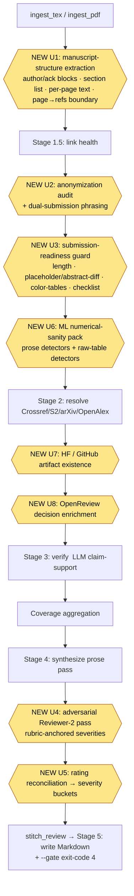

# feat: AAAI-27 acceptance-boosting capabilities

## Summary

Expand `prereview` from a citation-verifier into a **pre-submission acceptance tool** aimed at one concrete goal: getting the author's own paper through AAAI-27. Three phases, ordered by leverage against the deadline:

1. **Desk-reject guards** (deterministic, runnable on the draft today) — an anonymization audit for double-blind, and a submission-readiness guard for page length, placeholder/changed title-abstract, required-section/checklist completeness, and table-color usage. These convert *certain rejection* (a deanonymized, over-length, or abstract-mismatched paper is summarily rejected) into *being in the game*.
2. **Adversarial Reviewer-2** (one rubric-anchored LLM pass) — simulates the objections a real reviewer raises, bucketed by severity per dimension (novelty/positioning, baselines/experiments, claims-vs-evidence, reproducibility, clarity), with per-dimension severity rubrics so it cannot collapse into "everything is minor." Designed to **avoid the documented LLM-reviewer generosity collapse**, and to resolve the repo's standing rating-bias decision in the same stroke.
3. **Verification breadth** (deterministic + new external sources) — a CS/ML numerical-sanity pack, plus Hugging Face / GitHub artifact-existence checks and OpenReview decision enrichment.

Every new capability follows the two shipped templates: the deterministic-check pattern (`checklist.py`) and the graceful-degrading LLM-pass pattern (`verify.py` / the recover-then-disclose hardening). Author-facing findings stay high-precision and advisory; infrastructure failures are disclosed in the Coverage section, never rendered as author defects.

> **This plan was deepened (2026-06-18)** after an adversarial feasibility + completeness pass against the live codebase. The corrections it produced — per-page PDF extraction (not the flattened path), abstract-baseline diffing, table-aware numeric detectors, rubric-anchored severities, Papers-With-Code removed as defunct, `--gate` precedence and TeX-length honesty — are folded into the units and KTDs below.

---

## Problem Frame

**The deadline is real and close.** The AAAI-27 CFP is live (verified 2026-06-18): submission site opens **June 24**, abstract deadline **July 21**, full-paper deadline **July 28**, supplementary/code **July 31**, Phase-1 reject notifications Sept 24, author feedback Oct 19–25. From today that is **~5 weeks to the full-paper deadline**. The plan is sequenced so the cheapest, highest-impact, desk-reject-preventing capabilities land first and are runnable on the author's draft repeatedly before July 21.

**Desk rejection is binary and mechanically detectable.** AAAI summarily rejects for anonymization failures (main paper *or* supplementary), over-length (>7 pages of technical content; references excluded), placeholder OR substantially-changed abstract between the abstract and full-paper deadlines, dual submission, and formatting non-compliance — AAAI-26 issued a large desk-reject wave over checklist/appendix formatting, and AAAI press rules reject color-coded result tables. A paper that trips any of these has acceptance probability zero regardless of quality. Catching the mechanically-detectable ones is pure expected value.

**What actually drives accept/reject is anticipatable.** The empirical literature (NeurIPS consistency experiment: 23% inter-committee disagreement; REAL ML taxonomy; program-chair guidance) converges on a small set of reviewer-cited rejection reasons: weak novelty/positioning, missing/weak baselines, unsupported generality claims, reproducibility/ablation gaps, thin related work. Most are *anticipatable from the paper itself* — exactly what an adversarial pre-review pass can surface so the author fixes them before submission.

**LLM reviewers are uselessly generous unless constrained.** Keuper 2025 (arXiv:2509.10248) found >95% accept rates across many models on ICLR 2024 papers; AI-assisted reviews skew scores up. A naive "rate this paper / accept-or-reject" pass would inherit this and give the author false confidence — actively harmful for the goal. The mitigations that work (rubric-anchored scoring, aspect-specialized critique, severity buckets instead of a verdict, adversarial persona, grounding in concrete elements) are well documented (MARG arXiv:2401.04259; AgentReview arXiv:2406.12708; "When Your Reviewer is an LLM" arXiv:2509.09912 — explicitly about rubric calibration) and shape this plan's Reviewer-2 design. This also forces resolution of the repo's own standing open decision: the existing 1–10 suggested rating is at material risk of the same generosity bias.

**The tool is already shaped to absorb this.** `prereview` parses `.tex`/`.bib` deterministically, runs hygiene/retraction/link/checklist checks, and has a hardened resolve→verify→synthesize pipeline with three-state outcomes and graceful degradation. Every capability below is the *same class* of work as something already shipped, with documented extension seams.

---

## Requirements

Derived from the goal (improve AAAI-27 acceptance odds for a specific paper under a hard deadline) and the ROADMAP's pre-scoped items.

- **R1 — Prevent desk rejection.** Detect anonymization leaks, over-length, placeholder/changed title-abstract, color-coded result tables, and checklist incompleteness before submission.
- **R2 — Surface reviewer objections without generosity bias.** Produce an adversarial, rubric-anchored, severity-bucketed critique that maps to the real rejection categories, and that never collapses into "looks good / accept" or "everything is minor."
- **R3 — Give an honest overall signal.** Resolve the suggested-rating generosity bias; lead with severity, not an inflated number.
- **R4 — Catch CS/ML numerical errors before reviewers do.** Bounded-metric, split-arithmetic, mean±std, hyperparameter, and table-vs-abstract sanity checks.
- **R5 — Verify claimed artifacts and cited-paper outcomes.** Existence checks for claimed HF models/datasets and GitHub repos; OpenReview accept/reject + rating enrichment for cited papers.
- **R6 — Precision and honesty are non-negotiable.** Every author-facing finding is high-precision and advisory ("verify", never accusatory); infrastructure failures are disclosed as degradation, never as author defects; uncertain measurements degrade to warnings, never hard blocks.
- **R7 — Usable on the author's own draft within the AAAI-27 timeline.** Front-loaded, fast, repeatable; Phase 1 ships independently and early.

---

## High-Level Technical Design

New work attaches at three points in the existing `run_pipeline` flow. Source-level deterministic checks compute inside `ingest_tex` (TeX-first); network-dependent checks run after resolve; the adversarial pass and rating reconciliation run inside synthesize. Nothing reorders the existing stages.

Deterministic, source-level guards (U1–U3, U6) never make a network call and are safe to run on every save. Network checks (U7–U8) slot into the hardened three-state resolution + per-source circuit-breaker machinery and disclose degradation in the Coverage section. The Reviewer-2 pass (U4) and rating reconciliation (U5) are wrapped in the same prose-failure degradation contract already in `synthesize_review`.

**Phase sequencing against the AAAI-27 timeline** (today = 2026-06-18):

| Phase | Units | Capability | Land before | Why this order |
|---|---|---|---|---|
| 1 | U1–U3 | Desk-reject guards | **Jul 21** (abstract) | Binary catastrophic risk; deterministic; cheap; runnable repeatedly on the draft |
| 2 | U4–U5 | Adversarial Reviewer-2 + honest rating | **Jul 28** (full paper) | Improves the paper's review-score margin; needs Phase 1 findings as grounding |
| 3 | U6–U8 | Numerical sanity + artifact/OpenReview | Jul 31 / post-deadline | U6 catches errors pre-submission; U7–U8 are external, lowest deadline-priority |

---

## Key Technical Decisions

**KTD-1: Desk-reject guards are deterministic-first, not an LLM pass.** The ROADMAP framed the anonymization audit as "a single LLM pass." This plan implements it (and the venue-rules guard) deterministically instead — pure detectors over raw `.tex`, mirroring `checklist.py`. Rationale: the precision-over-recall convention, repeatability on every save, zero hallucination/generosity risk, sub-second runtime, and no token cost. Subtle/semantic anonymization leaks that genuinely need judgment are deferred to a follow-up LLM augmentation, not shipped noisy.

**KTD-2: Venue rules are externalized data, AAAI-27 first.** Detectors are generic; the per-venue facts (page limit 7, references-excluded, required sections, allowed checklist options, anonymization template fields, color-table rule) live in a data table keyed on robust signals — the same "generic parser, venue-specific data" decision the checklist linter already made. Adding NeurIPS/ACL later is data, not code.

**KTD-3: Anonymization audit runs name-free by default, name-aware on request.** Without input it runs four vectors — residual identity blocks (`\author`/`\thanks`/`\affiliation` with non-anonymized content), self-revealing phrasing ("our previous work [X]"), identity-revealing URLs (GitHub/GitLab/personal — also a no-links-to-supplementary violation), and a present acknowledgments section. An optional `--authors "Surname,Surname"` adds a surname-vs-body grep that **suppresses hits inside `\cite` arguments and known dataset/method n-grams** (a bare common-surname grep is too noisy for every-save use). Every finding quotes the exact offending fragment and is framed "verify this does not deanonymize you" — never "you leaked your identity."

**KTD-4: Length is PDF-only and approximate; it degrades to a warning, never a false hard block.** AAAI's 7-page limit is on the compiled PDF, which the TeX path cannot measure. The existing `ingest.extract_text` flattens all pages into one string before any caller sees them, so a **new per-page extractor** (`page_texts()`) is required to know which page the references heading lands on. Two-column AAAI PDFs routinely start references mid-page, so the technical-page count is inherently ±1. Therefore: report "approximately N technical pages (references heading detected on page K) — verify against the compiled PDF," and when the references boundary cannot be isolated, fall back to total-page count, say so, and emit a **warning, not a blocker**. On TeX input, length is unmeasurable — emit a one-line note, never a count. Over-length can only gate (`--gate`) on PDF input; this limit is stated explicitly so `prereview --gate draft.tex` is not mistaken for a length check.

**KTD-5: Reviewer-2 is rubric-anchored, aspect-bucketed, and severity-typed — never a verdict or a second score.** One LLM pass (mirroring `verify.py` house style: classify→judge, strict single-JSON output via `acompletion_json`, temperature 0.0, graceful degradation) produces per-dimension critiques each tagged `critical | major | minor` **against an explicit per-dimension severity rubric baked into `_REVIEWER2_SYSTEM`** (without anchors, the model defaults everything to `minor` and generosity reappears one level down). It must emit at least one finding *or an explicit "no issue found"* per dimension, so no dimension is silently skipped. The persona is an explicit "mean-but-defensible" adversarial brief, and every critique must quote a concrete paper element. It is grounded only in the paper plus the tool's own deterministic flags; the **novelty/positioning dimension cross-examines the paper's own related-work and citation list** for claimed-novelty-vs-cited-prior-art tension (zero external calls — this is how it engages the #1 reject reason without external retrieval). Automated discovery of genuinely *missing* external baselines stays deferred (precision-ceiling ~50–70%). This design is the documented antidote to the >95%-accept generosity collapse.

**KTD-6: Resolve the suggested-rating bias by dropping the number from the default output.** Reviewer-2 is the "more LLM-judged output" trigger the ROADMAP named. A caveat does not de-anchor an inflated number, and the tool's purpose here is to *avoid giving the author false confidence*. Default: lead with a severity-bucketed "Overall assessment" synthesized from all flags + Reviewer-2, and **omit the 1–10 range entirely** unless `--show-rating` is passed (where it renders with the explicit generosity caveat). This is the safer default against the exact failure mode the plan exists to prevent; the exact treatment remains an Open Question.

**KTD-7: New external sources reuse the three-state resolution + circuit-breaker + `http_retry` machinery; Papers-With-Code is out (defunct).** Papers-With-Code was wound down in mid-2025 and its public API no longer answers — U7 scopes to **Hugging Face (`huggingface_hub`) + a plain GitHub repo HEAD via `http_retry.get_with_retry`**, dropping the PWC arXiv→repo mapping and the heavy `mlcroissant` dependency. Each lookup classifies its own non-200/unparseable responses into HIT / TERMINAL_MISS / TRANSIENT_FAIL exactly like the resolver, discloses degradation in the Coverage & reliability section, and never invents a "missing artifact = author defect" verdict (mirror `VERIFICATION_UNAVAILABLE`'s exclusion from problem verdicts). Use each SDK's own retry **or** `http_retry`, never both. New keys (`HF_TOKEN`, OpenReview creds) join the `_DOTENV_KEYS` allowlist.

**KTD-8: Submission gating is opt-in via a new exit code, with defined precedence.** Advisory findings continue to never change the exit code. A new `--gate` flag makes *hard* desk-reject blockers (residual identity block, placeholder/empty/abstract-mismatch title or abstract, color-coded result table, unanswered mandatory checklist item, and — PDF only — over-length) exit non-zero (code **4**). Precedence is explicit: a hard blocker (4) outranks a coverage/degradation gap (existing code 3), which outranks clean (0). Default off preserves current exit semantics (0 clean / 1 error / 2 usage / 3 coverage-gap / 130 interrupt). On TeX input the only gateable blockers are placeholder/abstract-diff/color-table/checklist — not length.

**KTD-9: The "changed abstract between deadlines" guard is a local snapshot/diff.** AAAI's two-stage deadline (abstract Jul 21, full paper Jul 28) lets it reject papers whose final abstract diverges from the registered one. `--abstract-baseline PATH` writes the current abstract on first run and, on later runs, diffs against it; a divergence beyond a token threshold (or any change touching numbers/claims) is a `blocker`. Purely local, deterministic, reuses the existing `extract_abstract`. This is the most AAAI-specific desk-reject guard and is cheap.

---

## Scope Boundaries

**In scope** — U1–U8 below: manuscript-structure extraction (incl. per-page PDF text), anonymization audit, submission-readiness/venue-rules guard (length, placeholder + abstract-diff, color-tables, checklist completeness), adversarial Reviewer-2, rating reconciliation, ML numerical-sanity pack, HF/GitHub artifact existence, OpenReview enrichment; the `--gate` exit code; AAAI-27 as the first venue dataset.

**Deferred to Follow-Up Work**
- LLM augmentation of the anonymization audit for subtle/semantic self-revelation (ship deterministic vectors first).
- Other venues' rule/checklist data (NeurIPS, ACL/ARR) — additive data once the generic detectors exist.
- Multi-agent Reviewer-2 (one specialized agent per aspect, à la MARG). The single structured pass ships first; multi-pass is an enhancement if the single pass proves too shallow.
- Diff mode for revision rounds (re-run against a v2 paper for the Oct 19–25 rebuttal window) — high value later, out of this plan. (The U3 abstract-baseline mechanism is a narrow precursor.)
- Full-precision PDF length/format measurement (exact two-column overflow, figure-placement rules) — U3 length stays approximate-with-warning by design.

**Outside this product's identity** (per ROADMAP)
- Automated discovery of *missing* prior work / baseline-scout against external corpora (Phase 2; ~50–70% precision ceiling). Reviewer-2 interrogates the paper's *own* citations for novelty tension, but does not search the literature.
- **Dual/simultaneous-submission detection.** Genuine cross-corpus detection is out of scope by nature. U2 includes only a cheap in-paper "submitted/under review elsewhere" phrasing detector; it does not search other venues.
- Figure/table VLM critique; formal-proof checking; plagiarism/overlap detection.
- PDF prompt-injection sanitizing — explicitly declined for the single-user-local-CLI threat model; Reviewer-2 reads the user's own paper, so the threat does not apply. Do not re-introduce.
- Web UI, multi-tenant infra, multi-provider LLM ensembles.

---

## Phased Delivery

- **Phase 1 (U1–U3) — ship first, independently.** Deterministic desk-reject guards. No new dependencies, no network, no LLM. The one non-trivial piece is U1's per-page PDF extraction (a small refactor of `ingest.extract_text` to retain page boundaries). Target: usable on the draft well before the July 21 abstract deadline.
- **Phase 2 (U4–U5) — the paper-quality lever.** Adversarial Reviewer-2 plus the honest-rating reconciliation. Reuses `litellm`; no new dependency. Depends on Phase 1 findings as grounding input. Target: before the July 28 full-paper deadline.
- **Phase 3 (U6–U8) — breadth.** U6 (numeric sanity, deterministic) is pre-submission-valuable and dependency-free; do it next if Phase 2 lands early. U7–U8 add external dependencies (`huggingface_hub`, `openreview-py`) and are the lowest deadline-priority — fine to land after July 28 or for camera-ready.

---

## U1. Manuscript-structure extraction (foundation)

**Goal:** Parse the manuscript signals the desk-reject guards need but that the tool does not extract today — author/affiliation/acknowledgments blocks, a structured section list, per-page PDF text, and the references-start page — and attach them to `IngestedPaper` with back-compatible defaults.

**Requirements:** R1, R7.

**Dependencies:** none.

**Files:**
- `src/prereview/tex_ingest.py` — add `extract_author_block`, `extract_acknowledgments`, `extract_sections` (structured `\section{}` list) using the existing comment-strip-then-brace-aware helpers.
- `src/prereview/ingest.py` — add `page_texts(pdf_path) -> list[str]` that returns **per-page** text (the current `extract_text` flattens with `"\n".join(pages)`, destroying page boundaries — do not derive page numbers from it). Compute `page_count = len(reader.pages)` and `references_start_page` = index of the first page whose text matches the references-header regex; `None` when not isolable.
- `src/prereview/models.py` — add to `IngestedPaper`: `author_block: Optional[str] = None`, `acknowledgments: Optional[str] = None`, `section_titles: list[str] = Field(default_factory=list)`, `page_count: Optional[int] = None`, `references_start_page: Optional[int] = None`. New `AuthorBlock` type only if a flat string is insufficient.
- `tests/test_tex_ingest.py`, `tests/test_ingest.py`, `tests/test_models.py`.

**Approach:** Mirror `extract_title`'s `\title{...}` regex-on-raw-source approach for `\author{...}`, `\thanks{...}`, `\affiliation{...}`, and `\section*{Acknowledg(e)ments}` / `\begin{acks}`. Reuse `_strip_comments` and the brace-aware reader so commented-out blocks don't false-positive and nested braces/accent macros are tolerated. Section list is a brace-aware scan of `\section{...}` over the document body. For the PDF path, refactor extraction so per-page text survives (`page_texts`), then derive `references_start_page` from it; `extract_text` may delegate to `page_texts` + join to preserve its existing single-string contract for the citation path. All new fields default empty so the PDF path and existing tests stay green.

**Patterns to follow:** `extract_title`/`extract_abstract` (`tex_ingest.py`); brace-aware reader + `_strip_comments` (`checklist.py`); the references-header regex already used by `split_at_references` (`ingest.py`); back-compat default-field tests (`test_models.py`).

**Test scenarios:**
- Happy: `\author{Jane Smith \and John Doe}` → author_block captured; three `\section{...}` → `section_titles` of length 3 in order; 9-page PDF → `page_count == 9`; references heading on page 7 of 9 → `references_start_page == 7`.
- Edge: no `\author` → `author_block is None` (no crash); commented `% \author{...}` → ignored; nested braces `\author{Smith \thanks{Univ. of {X}}}` → captured whole; `\begin{acks}` and `\section*{Acknowledgements}` (en-GB) both recognized.
- Edge/error: **references heading not isolable** (no clear "References" page) → `references_start_page is None`, not a guess; TeX input → `page_count`/`references_start_page` both `None`; `page_texts` on a 0-page or unreadable PDF → empty list, handled.
- Round-trip: `model_dump()`/reconstruct covers every new field.
- Integration: an `IngestedPaper` from the existing TeX fixture exposes the new fields without disturbing `citations`/`references`.

**Verification:** New fields populate on TeX and PDF fixtures; `references_start_page` is `None` (not wrong) when the boundary is unclear; full suite stays green; no behavior change to existing sections.

---

## U2. Anonymization audit (deterministic, advisory)

**Goal:** Detect double-blind anonymization leaks (and a cheap dual-submission tell) in a submission and surface them as advisory "verify" findings — the single highest-EV desk-reject guard.

**Requirements:** R1, R6, R7.

**Dependencies:** U1 (author/ack blocks), reuses existing `extract_urls` + `_surrounding_sentence`.

**Files:**
- `src/prereview/anonymize.py` (new) — detector functions, mirroring `checklist.py` structure and docstring contract.
- `src/prereview/models.py` — `AnonymizationFinding` + `AnonymizationFindingKind` enum; `anonymization_found: bool`, `anonymization_findings: list[...]` on `IngestedPaper`.
- `src/prereview/synthesize.py` — `render_anonymization_section(bundle)` returning `None` when not run; methodology one-liner; splice into `stitch_review`.
- `src/prereview/tex_ingest.py` — compute findings in `ingest_tex` when enabled.
- `src/prereview/cli.py` — `--anonymize`/`--no-anonymize` (default on for `.tex`), `--authors "A,B"`; thread through `main → run_pipeline → ingest_tex`.
- `tests/test_anonymize.py`, plus rendering tests in `tests/test_synthesize.py`, CLI flag tests in `tests/test_cli.py`.

**Approach:** Four name-free detectors, one name-aware, one dual-submission tell:
1. **Residual identity block** — `author_block`/`\thanks`/`\affiliation` with non-anonymized content (not blank, not "Anonymous").
2. **Self-revealing phrasing** — a small high-precision phrase set ("in our previous work", "we previously showed/proposed", "our earlier paper", first-person possessive immediately preceding a self-`\cite`). Quote the sentence.
3. **Identity-revealing URLs** — scan existing `LinkCheck` URLs for GitHub/GitLab/personal-domain hosts; flag as both a deanonymization risk and an AAAI "no web links to supplementary" violation.
4. **Acknowledgments present** — `acknowledgments` non-empty in a submission build.
5. **Name-aware (only with `--authors`)** — grep each surname against body text **with suppression**: skip hits inside `\cite{...}` arguments and inside known dataset/method n-grams (e.g., "Smith-Waterman"); quote context for the rest.
6. **Dual-submission tell** — in-paper "submitted to / under review at / under submission" phrasing, advisory only (cannot detect actual dual submission).

Findings are advisory and quote the exact fragment; the renderer distinguishes "not run" from "ran clean." Honor the accusatory-words ban (frame as "verify").

**Patterns to follow:** `checklist.py` detector + two-tier finding shape; `render_checklist_section`/`render_hygiene_section` (None-when-empty); the advisory-not-accusatory test; `extract_urls` provenance.

**Test scenarios:**
- Happy: populated `\author{Jane Smith}` → residual-identity finding quoting the block; "In our previous work [4] we showed" → self-revealing finding; `https://github.com/jsmith/repo` → identity-URL finding; "under review at NeurIPS" → dual-submission tell.
- Edge / FP-suppression: `\author{Anonymous Authors}` and blanked field → no finding; third-person "their previous work" → no false positive; `--authors "Smith"` where "Smith" appears only inside `\cite{smith2020}` or as "Smith-Waterman" dataset → **suppressed**; common surname that is also an English word (e.g., "Park", "Bridge") inside a citation → suppressed; the same surname in running prose → flagged with context.
- Error/none: PDF input → section skipped with a one-line "TeX-source-only" note (no crash); `--no-anonymize` → section absent.
- Advisory framing: rendered Markdown never contains accusatory tokens (assert against the same banned-word list as checklist).
- Integration: `ingest_tex` attaches findings; `stitch_review` places the section; `--authors` threads end-to-end and appears in parsed args.

**Verification:** On the author's own draft the audit lists residual-identity, self-revealing, and identity-URL instances with zero accusatory phrasing and no surname noise from citations; clean input renders a clean-confirmation line; PDF input degrades with a note.

---

## U3. Submission-readiness / venue-rules guard

**Goal:** Flag the mechanical, desk-reject-eligible submission problems: over-length, placeholder/changed title or abstract, color-coded result tables, and required-element/checklist completeness — driven by an externalized AAAI-27 rules table.

**Requirements:** R1, R6, R7.

**Dependencies:** U1 (page_count, references_start_page, section list, title/abstract), existing checklist findings.

**Files:**
- `src/prereview/venue_rules.py` (new) — `VENUE_RULES` data table (AAAI-27 entry) + generic detectors.
- `src/prereview/models.py` — `SubmissionFinding` + kind enum; `submission_findings` on `IngestedPaper`; a `severity` field (`blocker | warning`) to support `--gate`.
- `src/prereview/synthesize.py` — `render_submission_section(bundle)`; methodology line; splice into `stitch_review`.
- `src/prereview/cli.py` — `--venue aaai-27` (default), `--gate`, `--abstract-baseline PATH`; map blockers to exit code 4 when `--gate`, with 4 > 3 precedence.
- `src/prereview/pipeline.py` — thread venue/baseline; compute exit-code contribution with precedence.
- `tests/test_venue_rules.py`, `tests/test_synthesize.py`, `tests/test_cli.py`, `tests/test_pipeline.py`.

**Approach:** AAAI-27 rules as data: `page_limit_technical=7`, `references_excluded=True`, `requires_abstract=True`, `placeholder_markers=["type your", "todo", "tbd", "lorem ipsum", "xxx", "goes here", ...]`, `min_abstract_words`, `checklist_required=True`, `color_table_macros=["\\cellcolor","\\rowcolor","\\columncolor","\\colorbox","\\textcolor"]`. Detectors:
- **Length** (KTD-4): PDF → technical pages = `references_start_page or page_count`, compare to 7; **uncertain boundary or TeX input → warning**, not blocker.
- **Placeholder/empty title/abstract** → `blocker`. Do **not** reuse the checklist's literal `"type your response here"` matcher — use the `placeholder_markers` list plus a too-short-abstract heuristic.
- **Changed abstract** (KTD-9): with `--abstract-baseline`, write-on-first-run / diff-on-later; divergence beyond threshold or any numeric/claim change → `blocker`.
- **Color result tables** (KTD-2): scan **raw** `tex_text` for color macros scoped inside `table`/`tabular` environments → `blocker` (AAAI press rule).
- **Checklist completeness** → reuse shipped checklist findings; an unanswered mandatory item surfaces here as a `blocker` for `--gate`.

Severity drives the opt-in exit code; default run stays advisory and exit-code-neutral.

**Patterns to follow:** checklist "generic parser, venue-specific data"; exit-code contract in `cli.py` (how coverage gaps map to 3); `_DROP_ENVS`/raw-`tex_text` access for table scanning; None-when-empty renderer.

**Test scenarios:**
- Happy: 9-page PDF, refs start page 8 → 8 technical pages > 7 → over-length blocker naming the count; empty `\title{}` → placeholder blocker; "Abstract goes here" / a 1-sentence abstract → placeholder/too-short blocker; `\cellcolor` inside a `tabular` → color-table blocker; abstract changed from baseline (a number edited) → changed-abstract blocker.
- Edge: 7 technical pages → no over-length; **uncertain references boundary → warning, not blocker**; TeX input → length warning only; unknown `--venue` → `parser.error` exit 2; `\textcolor` in body prose (not in a table) → no color-table finding.
- Gate + precedence: `--gate` with a blocker → exit 4; `--gate` clean → 0; without `--gate`, same blocker → 0; **both a `--gate` blocker and a coverage gap present → exit 4 (4 > 3)**; TeX `--gate` over-length situation → no length blocker fired (documented limitation), placeholder/color/checklist still gate.
- Integration: pipeline computes exit-code with precedence; `--gate`/`--venue`/`--abstract-baseline` parse and thread; section renders in order.

**Verification:** Over-length (PDF), placeholder, changed-abstract, and color-table drafts produce the right blockers/warnings; uncertain length never hard-fails; `--gate` returns a scriptable non-zero only on hard blockers with 4 > 3 precedence; advisory default never changes the exit code.

---

## U4. Adversarial Reviewer-2 pass

**Goal:** Generate a rubric-anchored, severity-bucketed adversarial critique that surfaces the objections a real AAAI reviewer would raise — without collapsing into generous praise or uniform "minor."

**Requirements:** R2, R6.

**Dependencies:** U1–U3 (deterministic flags as grounding); U5 consumes its output.

**Files:**
- `src/prereview/synthesize.py` — `_REVIEWER2_SYSTEM` (persona + per-dimension severity rubric), `async def _generate_reviewer2(bundle, *, verbose)`, `render_reviewer2_section(...)`; call from `synthesize_review` inside its own try/except; splice into `stitch_review` as a distinct `## Reviewer 2 (adversarial)` section after Weaknesses.
- `src/prereview/models.py` — add `reviewer2_degraded: bool = False` to `CoverageReport` (do **not** reuse `synthesis_degraded`, which drives the prose-failure message and exit-code-3 path — a Reviewer-2-only failure must not claim the narrative sections failed).
- `tests/test_synthesize.py`.

**Approach:** One `acompletion_json` call (synthesis model, temperature 0.0) over the same truncated `body_text` the prose pass builds, plus a compact summary of the tool's own flags (problematic citations, checklist gaps, anonymization/submission blockers, numeric flags when present) **and the paper's own related-work/citation list** for the novelty dimension. The prompt asks for per-dimension findings — **novelty/positioning, baselines/experiments, claims-vs-evidence, reproducibility, clarity** — each `{dimension, severity (critical|major|minor), issue, evidence (quoted element), suggested_fix}`, with **at least one finding or an explicit "no issue found" per dimension**. `_REVIEWER2_SYSTEM` carries the adversarial persona, the concrete-element requirement, an explicit **per-dimension severity rubric** (e.g., "baselines — critical: omits the standard SOTA baseline for the task; major: missing an obvious ablation; minor: a baseline is under-tuned"), and the hard rule that it must NOT emit an accept/reject verdict or numeric score. Reuse `_VALID_*`-style coercion for unknown severities. No caching (the prose pass isn't cached either). On LLM failure, set `coverage.reviewer2_degraded` and render a disclosed note.

**Patterns to follow:** `verify.py` (classify→judge, strict JSON, `_VALID_*` coercion, abstention/degradation); `_generate_prose` + `_PROSE_SYSTEM` (concrete-element requirement, body truncation); prose-failure degradation test.

**Test scenarios:**
- Happy: monkeypatched `acompletion_json` returns per-dimension findings → section renders grouped by dimension with severity tags and quoted evidence; every dimension present (finding or explicit "none").
- **Severity calibration:** a fixture paper with a known-critical flaw (e.g., a missing SOTA baseline injected into the flag summary) → assert the model is prompted such that the expected output is `critical`/`major`, and that the renderer faithfully shows it — i.e., test that the rubric and inputs reach the prompt (capture `kwargs["user"]`/`system`), not just that severities parse.
- Anti-generosity: a fixture where the model tries to return only praise / an accept verdict → renderer drops any verdict; assert no accept/reject token leaks into output.
- Novelty grounding: assert the related-work/citation list is included in the prompt (capture `kwargs["user"]`, assert a known cited title appears).
- Error: `acompletion_json` raises → review still writes every deterministic section; **`reviewer2_degraded` set, `synthesis_degraded` untouched** (assert the prose-degradation message does NOT appear when only Reviewer-2 failed).
- Integration: section ordering verified via `md.index`.

**Verification:** Reviewer-2 yields concrete, dimension-tagged, rubric-anchored, severity-bucketed critiques grounded in the paper and its own citations; it never prints a score or accept/reject; a Reviewer-2-only failure degrades without mislabeling the prose sections.

---

## U5. Rating reconciliation → severity-bucketed overall assessment

**Goal:** Resolve the standing suggested-rating generosity bias by leading the review with a severity-bucketed overall assessment and dropping the 1–10 number from the default output.

**Requirements:** R3, R6.

**Dependencies:** U4 (Reviewer-2 severities), U2/U3 (blocker/warning severities).

**Files:**
- `src/prereview/synthesize.py` — derive an `OverallAssessment` from the highest-severity findings across Reviewer-2 + submission + citation issues, **de-duplicated** so one underlying issue surfacing in two sources counts once; rewrite the `## Suggested rating` section to lead with buckets (`critical: N · major: N · minor: N`) and **omit the 1–10 line unless `--show-rating`** (when shown, render with the generosity caveat).
- `src/prereview/cli.py` — `--show-rating` flag (default off).
- `tests/test_synthesize.py`, `tests/test_cli.py`.

**Approach:** Pure aggregation over already-produced findings — no new LLM call. Counts by severity become the headline; the prose pass's `rating_low/high/justification` is retained internally but rendered only under `--show-rating` with the explicit "LLM-estimated, known to skew generous (Keuper 2025); treat as secondary" caveat. De-dup key: `(dimension/section, quoted-element)` so a submission blocker that Reviewer-2 also raises is not double-counted.

**Patterns to follow:** `_format_rating` (clamp/order) — retained for the `--show-rating` path; coverage-section disclosure tone; advisory framing.

**Test scenarios:**
- Happy: findings with 1 critical + 2 major → headline `critical: 1 · major: 2 · minor: 0`; default output contains **no 1–10 line**; `--show-rating` → the caveated line appears.
- Edge: no findings → "no critical or major concerns surfaced" headline.
- De-dup: the same issue present as both a submission blocker and a Reviewer-2 critical → counted **once** (assert the headline count, not the sum).
- Regression: the section never leads with a number; whenever the number is shown it carries the caveat string.
- Integration: severities flow from U2/U3/U4 into the aggregate.

**Verification:** The review leads with honest, de-duplicated severity buckets; the 1–10 is absent by default and caveated when opted in; counts match the underlying distinct findings.

---

## U6. ML numerical-sanity pack (deterministic)

**Goal:** Catch the CS/ML numerical errors reviewers pounce on — bounded-metric violations, split-arithmetic mismatches, impossible mean±std, hyperparameter table-vs-text drift, and table-vs-abstract deltas — at high precision.

**Requirements:** R4, R6.

**Dependencies:** U1 (body/sections + raw `tex_text`); independent of Phase 1/2.

**Files:**
- `src/prereview/numeric_sanity.py` (new) — five detector functions, externalized thresholds.
- `src/prereview/models.py` — `NumericFinding` + kind enum; `numeric_findings` on `IngestedPaper`.
- `src/prereview/synthesize.py` — `render_numeric_section(...)`; **edit `render_methodology` to remove/qualify the hardcoded "does not check reported statistics" bullet** (shipping U6 makes that promise false); splice into `stitch_review`.
- `src/prereview/cli.py` — `--numeric`/`--no-numeric`.
- `tests/test_numeric_sanity.py`, `tests/test_synthesize.py`.

**Approach:** Implement the five ROADMAP-scoped checks. **Three run over the stripped body** (prose): (1) accuracy/F1 ≤ 100 (or 1.0); (2) train/val/test split sums to stated cardinality; (3) mean±std lower tail crosses a metric ceiling. **Two require tables, which `strip_tex_to_text` deletes via `_DROP_ENVS` — so they run over the raw `tex_text`, extracting `tabular`/`table` bodies directly**: (4) `lr=`/batch/epochs prose-vs-table, flag only when magnitudes differ >2×; (5) result-table vs abstract delta consistency. Each detector is pure and individually unit-tested; the registry is capped and precision-guarded (mirror `test_cross_checks_table_is_small_and_high_precision`). Advisory framing.

**Patterns to follow:** `checklist.py` detector purity + precision table-size guard; raw-`tex_text` table access (the source is already read in `ingest_tex`); None-when-empty renderer; advisory wording.

**Test scenarios:**
- Happy (each fires once): "accuracy of 102.3%" → bounded-metric; "train 8k / val 1k / test 2k of 10k" → split (sums to 11k); "99.5 ± 1.2" on a 0–100 metric → mean±std; prose `lr=0.1` vs table `lr=0.001` (>2×) → hyperparameter; abstract "+5.2 points" vs table "+2.1" → delta.
- **False-positive corpus (the precision guarantee):** a table-driven set of **≥15–20 realistic benign numeric sentences** from real ML prose asserting **zero findings**, with an adversarial-benign subset targeting detectors #3/#4 specifically — scientific notation (`1e-3` vs `0.001` → equal magnitude, no flag), `±` used as tolerance not std, ranges ("0.1–0.9"), percentages in non-metric prose ("95% of users"), F1 of 0.87 (in-bounds).
- Methodology coherence: assert `render_methodology` no longer claims statistics are unchecked once `--numeric` ran.
- Precision guard: detector-registry size asserted to stop noisy drift.
- Integration: findings attach (body + raw tables) in `ingest_tex` and render in order.

**Verification:** Planted errors fire at 100% on fixtures; the ≥15–20 benign corpus produces zero findings; the methodology section no longer contradicts the shipped check; the section is advisory.

---

## U7. Artifact existence checks (Hugging Face + GitHub)

**Goal:** When the paper claims a model, dataset, or code repo, verify the artifact exists and surface license/dataset-card drift — CS/ML-native ghost-artifact catching the citation resolver cannot do. **Papers-With-Code is excluded (defunct since mid-2025).**

**Requirements:** R5, R6.

**Dependencies:** U1 (URLs/claims); the three-state resolution + `http_retry` machinery.

**Files:**
- `src/prereview/artifacts.py` (new) — HF `model_info`/`dataset_info` existence; GitHub repo HEAD via `http_retry.get_with_retry`; classify responses into HIT/TERMINAL_MISS/TRANSIENT_FAIL.
- `src/prereview/models.py` — `ArtifactCheck` result type (reuse `Resolution`'s three-state shape where possible).
- `src/prereview/synthesize.py` — render under Citation issues / Coverage; degradation disclosed in Coverage.
- `src/prereview/cli.py` — `--artifacts`/`--no-artifacts`; add `HF_TOKEN` to `_DOTENV_KEYS`.
- `pyproject.toml` — add `huggingface_hub` only (no `mlcroissant`, no PWC client).
- `tests/test_artifacts.py` (respx-mocked + feature-flag-off path), `tests/test_cli.py`.

**Approach:** Extract claimed artifacts from URLs/body (`huggingface.co/...`, `github.com/...` — `_REPO_HOSTS` already lists these). Probe HF via `huggingface_hub` (reuse its retry) and GitHub via a single `http_retry.get_with_retry` HEAD — single layer only. A 200-with-unparseable-body is TRANSIENT_FAIL (not a miss). Missing/degraded artifacts disclose in Coverage; never a "you faked this" verdict. **Before building, run a live smoke probe** of the HF endpoints to confirm shape; gate the feature flag so an HF outage degrades cleanly.

**Patterns to follow:** three-state Resolution + per-source breaker (`resolve.py`); `respx` HTTP tests (`test_resolve.py`); `VERIFICATION_UNAVAILABLE` exclusion from problem verdicts; `_DOTENV_KEYS` + autoload test.

**Test scenarios:**
- Happy: claimed HF model that exists (mocked 200 + JSON) → HIT, no finding; nonexistent model (404) → TERMINAL_MISS → advisory "artifact not found — verify"; GitHub repo 200 HEAD → HIT.
- Edge: 200 with malformed JSON → TRANSIENT_FAIL → disclosed as degradation, not a miss; 429 + Retry-After → single retry, breaker respected.
- **Feature-flag-off / unavailable (first-class, not an afterthought):** `--no-artifacts` → skipped; HF unreachable → check skipped, Coverage notes degradation, pipeline exits green.
- Config: `HF_TOKEN` autoloaded from `.env` (mirror the existing key test).

**Verification:** Existing artifacts pass silently; missing ones are advisory; all infra failures disclose as degradation; offline runs complete; no PWC dependency anywhere.

---

## U8. OpenReview decision enrichment

**Goal:** When a cited paper is on OpenReview, surface its accept/reject decision and rating distribution — catching papers cited as foundational that were actually rejected.

**Requirements:** R5, R6.

**Dependencies:** U7's external-source scaffolding; resolved DOIs/arXiv IDs from Stage 2.

**Files:**
- `src/prereview/openreview_enrich.py` (new) — resolve cited paper → OpenReview note via DOI/arXiv ID; fetch decision + rating distribution; **silent skip when no creds and when no OpenReview ID**.
- `src/prereview/models.py` — optional `openreview` enrichment fields on the verification/reference record.
- `src/prereview/synthesize.py` — annotate Citation issues / references with decision when present.
- `src/prereview/cli.py` — `--openreview`/`--no-openreview` (default off); OpenReview creds in `_DOTENV_KEYS`.
- `pyproject.toml` — add `openreview-py`.
- `tests/test_openreview_enrich.py` (mocked), `tests/test_cli.py`.

**Approach:** Map each resolved reference (ICLR 2017+, NeurIPS 2022+, COLM, TMLR, RLC, AISTATS) to an OpenReview note via DOI/arXiv ID; pull decision + ratings via `openreview-py`. **`openreview-py` is synchronous (`requests`-based) while the pipeline is `asyncio` — wrap client calls in `asyncio.to_thread` so they don't block the event loop.** Most decision/rating queries require credentials; **no creds → skip U8 entirely as a first-class, tested path** (not an error). Annotation is advisory enrichment ("cited as foundational; OpenReview decision: reject — verify it's the right reference"), never a defect verdict. Degradation disclosed in Coverage.

**Patterns to follow:** three-state classification (KTD-7); OpenReview-via-DOI/arXiv fallback as ROADMAP-scoped; advisory annotation tone; `asyncio.to_thread` for sync SDKs.

**Test scenarios:**
- Happy: cited arXiv id maps to an OpenReview note with a reject decision → advisory annotation rendered.
- Edge: no OpenReview ID → silent skip; **no creds → U8 skipped cleanly, pipeline green** (tested); note exists but no decision field → no annotation, no crash.
- Error: OpenReview API down → degradation disclosed; pipeline completes; the sync call is `to_thread`-wrapped (no event-loop block).
- Config: OpenReview creds autoloaded from `.env`.

**Verification:** Mapped citations gain an advisory decision annotation; no-creds and unmapped cases skip silently; failures disclose as degradation without blocking the loop.

---

## Risks & Mitigations

- **PDF page-length is approximate and gates a blocker.** Two-column references often start mid-page, so the technical-page count is ±1; a wrong count under `--gate` is a false desk-reject block — the worst failure for the author. *Mitigation (KTD-4, U1/U3):* per-page extraction, references-boundary detection with an explicit "uncertain → warning, not blocker" fallback, "approximately N pages — verify" framing, and a tested boundary-not-found path. TeX never produces a length blocker.
- **Anonymization false positives** (legit third-person "our approach", a common surname in a citation/dataset). *Mitigation (KTD-3, U2):* high-precision phrase set, `--authors` suppression of `\cite`/dataset/method hits, advisory "verify" framing, always quote context. Banned-accusatory-word test enforced.
- **Reviewer-2 generosity reappearing as uniform "minor."** Severity labels without anchors collapse one level down. *Mitigation (KTD-5, U4):* per-dimension severity rubric in the system prompt, forced finding-or-explicit-none per dimension, own-citation novelty grounding, adversarial persona, concrete-element requirement, temperature 0.0; a test that the rubric + critical-flaw inputs reach the prompt. Residual: it cannot find *missing external* baselines (deferred).
- **Numeric-sanity false positives** on benign numerics (sci-notation, tolerances, ranges). *Mitigation (U6):* the ≥15–20 benign corpus test gating detectors #3/#4; >2× magnitude threshold; registry-size precision guard.
- **U6 contradicting the methodology promise.** *Mitigation (U6):* edit `render_methodology` in the same unit.
- **Papers-With-Code is defunct.** *Mitigation (KTD-7, U7):* removed entirely; U7 is HF + GitHub HEAD only; live smoke probe before build; feature-flag-off is a first-class tested path.
- **OpenReview sync SDK + mandatory creds.** *Mitigation (U8):* `asyncio.to_thread`; no-creds → first-class silent skip; default off.
- **AAAI-27 author kit not yet published.** Anonymization/format specifics are sourced from the AAAI-26 kit; the *dates* are confirmed from the live AAAI-27 CFP. *Mitigation (KTD-2):* rules externalized as data; re-verify and bump the AAAI-27 entry when the kit drops.
- **Deadline risk for Phase 3.** *Mitigation:* strict phase ordering; Phase 1 ships independently and first; U6 (dependency-free) precedes U7–U8.
- **Adding LLM-judged outputs amplifies rating bias.** *Mitigation (KTD-6, U5):* drop the number by default; never add a second generous one.

---

## Open Questions

1. **Rating reconciliation default (U5/KTD-6).** Plan now defaults to **dropping the 1–10** number (severity buckets only; `--show-rating` to opt back in). Confirm this is the wanted default vs. demote-with-caveat vs. keep.
2. **Abstract-diff threshold (U3/KTD-9).** What counts as a "substantial" abstract change — a token-overlap threshold (e.g., >20% changed), any edit to a number/claim, or both? Recommended: any numeric/claim edit OR >20% token change → blocker.
3. **Hard-blocker set for `--gate` (U3/KTD-8).** Proposed: residual identity block, placeholder/empty/abstract-diff title or abstract, color result table, unanswered mandatory checklist item, and PDF-only over-length. Confirm the set and the exit code (proposed 4, precedence 4 > 3).
4. **Reviewer-2 default (U4).** On by default for `.tex` (one extra Opus pass per run) vs behind `--reviewer2`. Recommended: on for `.tex`, given the deadline value.
5. **`--authors` input UX (U2).** A CLI flag vs a non-anonymized sidecar file the audit reads. Recommended: start with the flag.
6. **Phase 3 vs the deadline.** Build U6 before July 28 (recommended if Phase 2 lands early); U7–U8 after the draft is locked / for camera-ready.

---

## Success Metrics

- **Phase 1:** On the author's own draft, the guards enumerate the **mechanically-detectable** desk-reject risks they implement — residual identity, identity URLs, placeholder/changed abstract, color result tables, PDF over-length (approximate), and checklist gaps — with **zero accusatory phrasing**, **zero surname noise from citations**, and **no hard block from an uncertain page count**; full run completes in seconds and is safe to repeat on every save. `--gate` returns a scriptable non-zero only on hard blockers, with 4 > 3 precedence. (Dual-submission and AAAI-26-style appendix-placement nuances are explicitly out of scope or advisory-only — not claimed as covered.)
- **Phase 2:** Reviewer-2 produces, on a representative draft, **at least one rubric-anchored finding (or explicit "none") per dimension**, assigns `critical`/`major` to an injected critical flaw rather than `minor`, **never** emits an accept/reject verdict or score, grounds novelty critique in the paper's own citations, and degrades gracefully (without mislabeling the prose sections) on LLM failure. The review leads with de-duplicated severity buckets.
- **Phase 3:** The numeric pack fires at **100% on planted-error fixtures** and produces **zero findings on a ≥15–20-sentence benign corpus** (incl. the sci-notation/tolerance/range adversarial-benign cases); HF/GitHub/OpenReview checks **disclose degradation** and complete offline and credential-free.

---

## Dependencies / Prerequisites

- **Phases 1–2: no new dependencies.** Reuse `pydantic`, `httpx`, `litellm`, the existing TeX parser, and `http_retry`. The one refactor is U1's per-page PDF extraction in `ingest.py`.
- **Phase 3:** add `huggingface_hub` (U7) and `openreview-py` (U8). **No `mlcroissant`, no Papers-With-Code client** (defunct). New env keys (`HF_TOKEN`, OpenReview creds) join `_DOTENV_KEYS` with autoload tests. `openreview-py` is synchronous — call it via `asyncio.to_thread`.
- **Testing:** `.venv/bin/python -m pytest -q` (per project memory — bare `pytest` resolves to the wrong interpreter). New external calls are `respx`-mocked, with a first-class unavailable/no-creds path each; new LLM passes monkeypatch `acompletion_json`. No linter configured.

---

## Sources & Research

- **AAAI-27 CFP (dates, page limit, policy)** — https://aaai.org/conference/aaai/aaai-27/main-technical-track-call/ (live, verified 2026-06-18).
- **AAAI-26 submission + anonymization + reproducibility checklist** (operative template until the AAAI-27 author kit publishes) — https://aaai.org/conference/aaai/aaai-26/submission-instructions/ , https://aaai.org/conference/aaai/aaai-26/reproducibility-checklist/ ; AAAI-26 desk-reject wave — https://cspaper.org/post/324 .
- **LLM-reviewer generosity / bias** — Keuper 2025 (arXiv:2509.10248, >95% accept); "When Your Reviewer is an LLM" (arXiv:2509.09912, calibration via rubric); prompt-injection in submissions (Lin et al., arXiv:2507.06185).
- **Review-simulation prior art** — MARG (arXiv:2401.04259, aspect-specialized agents); AgentReview (arXiv:2406.12708, persona variance); ReviewAgents (arXiv:2503.08506).
- **What drives accept/reject** — NeurIPS consistency experiment (arXiv:2306.03262, 23% disagreement); REAL ML limitations taxonomy (arXiv:2205.08363).
- **Repo institutional record** — `ROADMAP.md` (Queued #1–#4, deferred Reviewer-2, Open decisions); `docs/plans/2026-06-17-001-feat-aaai-checklist-linter-plan.md` (deterministic-check template); `docs/plans/2026-06-17-002-feat-recover-disclose-hardening-plan.md` (three-state resolution + graceful degradation).
- **Deepening pass (2026-06-18)** — adversarial feasibility + completeness review against the live codebase; corrections folded into U1 (per-page extraction), U3 (abstract-diff, color-tables, length-as-warning, gate precedence), U4 (rubric anchors, own-citation grounding, `reviewer2_degraded`), U5 (drop-number default, de-dup), U6 (raw-table detectors, methodology edit, benign corpus), U7 (PWC removed), U8 (sync/async + no-creds skip).
